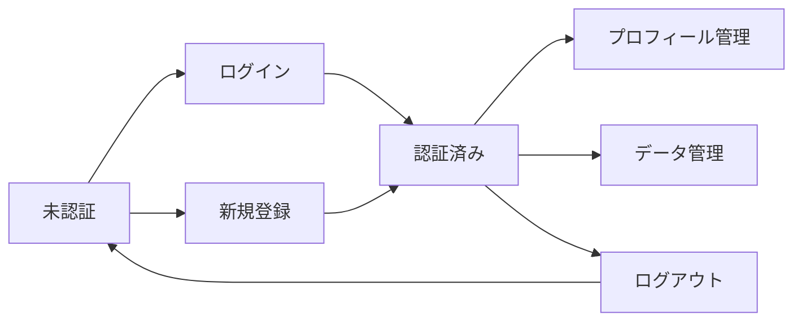
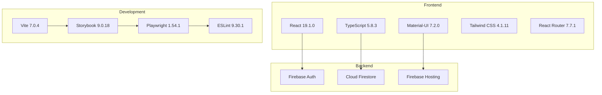
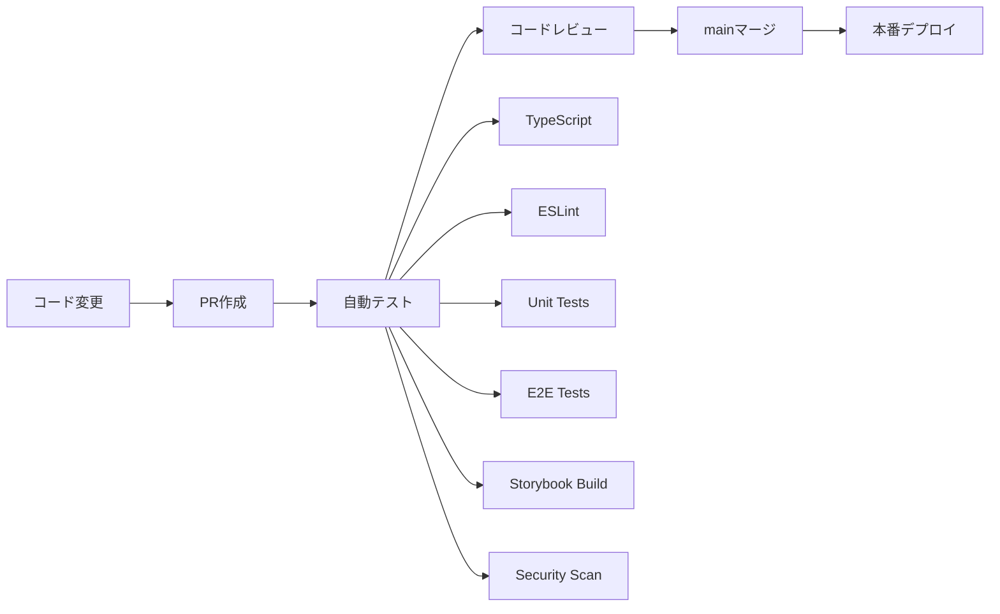

# 🚀 React Firebase Sample App

**わたなべによるわたなべのためのReact学習用プロジェクト**

React + TypeScript + Firebase + Gemini AI を利用したわたなべのお勉強アプリ

[](https://github.com/your-repo/react-firebase-app/actions)
[](https://your-storybook-url.com)
[](https://www.typescriptlang.org/)
[](https://firebase.google.com/)


---

## 🎯 このプロジェクトについて

### 特徴
- 🔥 **Modern Stack**: React 19 + TypeScript + Firebase
- 🤖 **AI Integration**: Gemini API によるマルチモーダル処理
- 🎵 **Audio Features**: 音声録音・再生・文字起こし
- 📁 **File Upload**: 画像・動画・PDF・Excel・Markdown対応
- 🔍 **AI Search**: 自然言語検索機能
- 📚 **Storybook**: コンポーネント駆動開発
- 🎭 **E2E Testing**: Playwright による自動テスト
- 🚀 **CI/CD**: GitHub Actions による自動化
- 📱 **Responsive**: モバイル・デスクトップ対応
- 🔐 **Secure**: Firebase セキュリティルール適用

### Vue.js開発者向け学習ポイント
| Vue.js 3 | React | このプロジェクトで学べること |
|----------|-------|---------------------------|
| Composition API | Hooks | `useAuthActions.ts` でカスタムフック |
| reactive/ref | useState | `useState` による状態管理 |
| computed | useMemo | パフォーマンス最適化 |
| provide/inject | Context API | `AuthContext.tsx` で状態共有 |
| Vue Router | React Router | SPA ルーティング |

---

## 📚 ドキュメント

- 📖 **[プロジェクト概要](./docs/PROJECT_OVERVIEW.md)** - 技術スタック・アーキテクチャ
- 🎨 **[Storybook ガイド](./docs/STORYBOOK_GUIDE.md)** - コンポーネント開発手法
- 🔄 **[CI/CD 図解ガイド](./docs/CICD_VISUAL_GUIDE.md)** - 自動化フロー
- ⚙️ **[GitHub Actions 設定](./docs/GITHUB_ACTIONS_SETUP.md)** - CI/CD 設定手順

---

## 🚀 クイックスタート

### ⚡ 簡単セットアップ

**個人のFirebaseプロジェクトでアプリを動作させる場合：**

👉 **[詳細セットアップガイド](./SETUP_GUIDE.md)** を参照してください

### 開発者向けクイックスタート

```bash
# リポジトリクローン
git clone <repository-url>
cd react-firebase-app

# 依存関係インストール
npm install

# 環境変数設定（.env.local作成）
# 詳細は SETUP_GUIDE.md を参照

# 開発サーバー起動
npm run dev
```

### Firebase・Gemini API設定

```bash
# Firebase CLI インストール（グローバル）
npm install -g firebase-tools

# Firebase & Gemini API設定
firebase login
firebase init
```

### 3. 環境変数設定

```bash
# 環境変数ファイル作成
cp .env.example .env.local

# .env.local を編集して Firebase 設定を追加
VITE_FIREBASE_API_KEY=your_api_key_here
VITE_FIREBASE_AUTH_DOMAIN=your_project.firebaseapp.com
VITE_FIREBASE_PROJECT_ID=your_project_id
# ... その他の Firebase 設定
```

### 4. 開発サーバー起動

```bash
# アプリケーション起動
npm run dev
# → http://localhost:5173

# Storybook起動（別ターミナル）
npm run storybook
# → http://localhost:6006
```

---

## 🎮 利用可能なコマンド

### 開発
```bash
npm run dev          # 開発サーバー起動
npm run build        # 本番ビルド
npm run preview      # ビルド結果プレビュー
```

### 品質管理
```bash
npm run type-check   # TypeScript型チェック
npm run lint         # ESLint実行
npm run test         # ユニットテスト
npm run test:e2e     # E2Eテスト（Playwright）
```

### Storybook
```bash
npm run storybook        # Storybook開発サーバー
npm run build-storybook  # Storybookビルド
```

### テスト
```bash
npm run test:e2e:ui      # E2Eテスト（UIモード）
npm run test:e2e:report  # E2Eテストレポート表示
```

---

## 🎯 実装されている機能

### ✅ 認証システム


- **ユーザー登録・ログイン** - Firebase Authentication
- **フォームバリデーション** - リアルタイム検証
- **プライベートルート** - 認証保護
- **セッション管理** - 自動ログアウト

### ✅ データ管理（CRUD）
- **作成・読み取り・更新・削除** - Cloud Firestore
- **リアルタイム同期** - データベース変更の即座反映
- **ユーザー固有データ** - セキュリティルール適用
- **カテゴリ・優先度** - データ分類機能

### ✅ UIコンポーネント
- **レスポンシブデザイン** - モバイル・デスクトップ対応
- **Material-UI** - 統一されたデザインシステム
- **Storybook** - コンポーネントドキュメント
- **アクセシビリティ** - ARIA対応

---

## 🏗️ アーキテクチャ

### ディレクトリ構成
```
react-firebase-app/
├── 📂 .github/workflows/    # CI/CD パイプライン
├── 📂 .storybook/          # Storybook設定
├── 📂 docs/                # プロジェクトドキュメント
├── 📂 e2e/                 # E2Eテスト
├── 📂 src/
│   ├── 📂 components/      # UIコンポーネント
│   │   ├── auth/           # 認証関連
│   │   ├── common/         # 共通コンポーネント
│   │   ├── forms/          # フォーム関連
│   │   └── layout/         # レイアウト
│   ├── 📂 contexts/        # React Context
│   ├── 📂 hooks/           # カスタムフック
│   ├── 📂 pages/           # ページコンポーネント
│   ├── 📂 services/        # 外部サービス連携
│   └── 📂 types/           # TypeScript型定義
├── firebase.json           # Firebase設定
├── playwright.config.ts    # E2Eテスト設定
└── package.json
```

### 技術スタック


---

## 🧪 テスト戦略

### テストピラミッド
```mermaid
pyramid
    title "テストカバレッジ目標"
    
    "E2E Tests" : 20
    "Component Tests" : 30  
    "Unit Tests" : 50
```

### 各種テスト
| テスト種別 | ツール | カバレッジ | 実行コマンド |
|-----------|--------|-----------|-------------|
| **Unit** | Vitest + Testing Library | 85% | `npm run test` |
| **Component** | Storybook | 70% | `npm run build-storybook` |
| **E2E** | Playwright | 45% | `npm run test:e2e` |

### E2Eテスト例
```typescript
// e2e/auth.spec.ts
test('ログイン機能', async ({ page }) => {
  await page.goto('/login')
  await page.fill('input[type="email"]', 'test@example.com')
  await page.fill('input[type="password"]', 'password123')
  await page.click('button:has-text("ログイン")')
  
  await expect(page).toHaveURL('/dashboard')
})
```

---

## 🔄 CI/CD パイプライン

### 自動化フロー


### GitHub Actions ワークフロー
1. **[CI/CD Pipeline](./.github/workflows/ci.yml)** - メインパイプライン
2. **[Branch Protection](./.github/workflows/branch-protection.yml)** - PR品質チェック
3. **[Preview Deploy](./.github/workflows/preview.yml)** - プレビュー環境
4. **[PR Automation](./.github/workflows/pr-automation.yml)** - PR自動化
---

## 📊 Vue.js → React 移行ガイド

### 概念対応表
| 概念 | Vue.js 3 | React | 実装例 |
|------|----------|-------|--------|
| **状態管理** | `ref`, `reactive` | `useState` | `const [count, setCount] = useState(0)` |
| **副作用** | `watchEffect` | `useEffect` | `useEffect(() => {}, [deps])` |
| **算出値** | `computed` | `useMemo` | `useMemo(() => calc, [deps])` |
| **ライフサイクル** | `onMounted` | `useEffect` | `useEffect(() => {}, [])` |
| **カスタムロジック** | `composables` | `custom hooks` | `useAuthActions.ts` |
| **状態共有** | `provide/inject` | `Context API` | `AuthContext.tsx` |

### 学習の進め方
1. **Phase 1**: JSX構文・基本概念 (1-2週)
2. **Phase 2**: Hooks・状態管理 (2-3週)  
3. **Phase 3**: Router・API連携 (1-2週)
4. **Phase 4**: テスト・デプロイ (1-2週)

---

## 🔥 Firebase セットアップ

### 1. プロジェクト作成
```bash
# Firebase Console でプロジェクト作成
# → https://console.firebase.google.com/

# 必要な機能を有効化
# ✅ Authentication (Email/Password)
# ✅ Cloud Firestore
# ✅ Hosting
```

### 2. セキュリティルール
```javascript
// firestore.rules
rules_version = '2';
service cloud.firestore {
  match /databases/{database}/documents {
    match /dataItems/{document} {
      allow read, write: if request.auth != null 
        && request.auth.uid == resource.data.userId;
    }
  }
}
```

### 3. 環境変数
```bash
# .env.local
VITE_FIREBASE_API_KEY=AIza...
VITE_FIREBASE_AUTH_DOMAIN=project.firebaseapp.com
VITE_FIREBASE_PROJECT_ID=project-id
VITE_FIREBASE_STORAGE_BUCKET=project.appspot.com
VITE_FIREBASE_MESSAGING_SENDER_ID=123456789
VITE_FIREBASE_APP_ID=1:123:web:abc
```

---

## 🎨 Storybook コンポーネント開発

### Storybookの活用
```bash
# Storybook開発サーバー起動
npm run storybook

# アクセス
# → http://localhost:6006
```

### コンポーネント例
```typescript
// Card.stories.tsx
export const Default: Story = {
  args: {
    title: 'サンプルカード',
    content: 'カードの内容です...',
    tags: ['React', 'TypeScript'],
  },
}
```

### 実装されているストーリー
- **Common Components**: Card, LoadingSpinner, ErrorMessage
- **Form Components**: SearchBox
- **Design Tokens**: Colors, Typography, Spacing

---

## 🚨 トラブルシューティング

### よくある問題

#### Firebase接続エラー
```bash
# 環境変数の確認
cat .env.local

# Firebase設定の確認
firebase projects:list
```

#### TypeScriptエラー
```bash
# 型チェック実行
npm run type-check

# 依存関係の再インストール
rm -rf node_modules package-lock.json
npm install
```

#### E2Eテスト失敗
```bash
# ローカルでE2Eテスト実行
npm run test:e2e

# UIモードで実行（デバッグ用）
npm run test:e2e:ui
```

#### Storybookビルドエラー
```bash
# Storybookビルド確認
npm run build-storybook

# Storybook依存関係確認
npm list @storybook/*
```

---

## 📚 学習リソース

### 公式ドキュメント
- 📖 [React Documentation](https://react.dev/) - 最新のReact公式ガイド
- 🔥 [Firebase Documentation](https://firebase.google.com/docs) - Firebase全機能
- 📚 [Storybook Docs](https://storybook.js.org/docs) - コンポーネント開発
- 🎭 [Playwright Docs](https://playwright.dev/docs) - E2Eテスト

### Vue.js → React 移行
- 🔄 [React for Vue Developers](https://sebastiandedeyne.com/react-for-vue-developers/)
- 📋 [Vue to React Cheatsheet](https://vue-to-react.netlify.app/)
- 🧠 [思考の切り替え](https://reactjs.org/docs/thinking-in-react.html)

### TypeScript
- 📘 [TypeScript Handbook](https://www.typescriptlang.org/docs/)
- ⚛️ [React TypeScript Cheatsheet](https://github.com/typescript-cheatsheets/react)

---

## 🚀 デプロイ

### Firebase Hosting
```bash
# ビルド
npm run build

# デプロイ
firebase deploy

# プレビューURL生成
firebase hosting:channel:deploy preview-branch
```

### 他のプラットフォーム
- **Vercel**: Git連携で自動デプロイ
- **Netlify**: ドラッグ&ドロップデプロイ
- **AWS S3**: 手動アップロード
- **Docker**: コンテナ化デプロイ

---

## 🤝 コントリビューション

### 参加方法
1. 🍴 Fork the repository
2. 🌱 Create feature branch (`git checkout -b feature/amazing-feature`)
3. ✨ Commit changes (`git commit -m 'Add amazing feature'`)
4. 📤 Push to branch (`git push origin feature/amazing-feature`)
5. 🔄 Create Pull Request

### 開発ルール
- ✅ TypeScript厳格モード
- ✅ ESLint + Prettier
- ✅ Conventional Commits
- ✅ テストカバレッジ維持
- ✅ Storybook更新

---

## 🎉 今後の拡張予定

### 短期 (1-3ヶ月)
- [ ] **PWA対応** - オフライン機能
- [ ] **国際化 (i18n)** - 多言語対応  
- [ ] **ダークモード** - テーマ切り替え
- [ ] **通知機能** - リアルタイム通知

### 中期 (3-6ヶ月)  
- [ ] **画像アップロード** - Firebase Storage
- [ ] **リアルタイムチャット** - WebSocket
- [ ] **検索機能強化** - 全文検索
- [ ] **管理画面** - データ管理

### 長期 (6-12ヶ月)
- [ ] **マイクロフロントエンド** - Module Federation
- [ ] **GraphQL連携** - Apollo Client
- [ ] **SSR対応** - Next.js移行
- [ ] **モバイルアプリ** - React Native

---

## 📄 ライセンス

このプロジェクトは [MIT License](./LICENSE) の下で公開されています。

---

## 🙏 謝辞

このプロジェクトは以下のオープンソースプロジェクトに支えられています：

- [React](https://reactjs.org/) - UIライブラリ
- [Firebase](https://firebase.google.com/) - バックエンドサービス
- [Material-UI](https://mui.com/) - UIコンポーネント
- [Storybook](https://storybook.js.org/) - コンポーネント開発
- [Playwright](https://playwright.dev/) - E2Eテスト
- [Vite](https://vitejs.dev/) - ビルドツール


[⭐ Star this repo](https://github.com/your-repo/react-firebase-app) | [🐛 Report Bug](https://github.com/your-repo/react-firebase-app/issues) | [💡 Request Feature](https://github.com/your-repo/react-firebase-app/issues)

</div>