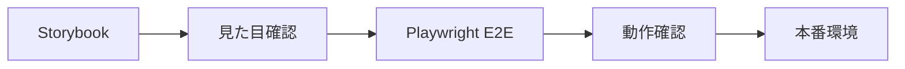
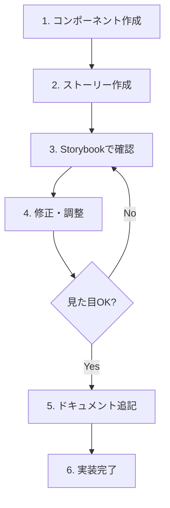

# 📚 Storybook 初心者ガイド

## 🎯 Storybookとは？

**Storybook**は、UIコンポーネントを独立して開発・テスト・ドキュメント化するためのツールです。

```
🔧 従来の開発        →    📚 Storybookを使った開発
アプリ全体を起動      →    コンポーネント単体で開発
他の部分に依存       →    完全に独立した環境
確認が大変          →    様々な状態を一目で確認
```

### ✨ メリット

| 利点 | 説明 | 例 |
|------|------|-----|
| 🔬 **独立開発** | 他の部分を気にせずコンポーネントだけに集中 | ボタンだけを単独で確認・修正 |
| 📖 **自動ドキュメント** | プロパティや使用方法を自動生成 | TypeScript型から使い方を自動作成 |
| 🧪 **視覚的テスト** | 様々な状態を同時に確認 | 正常・エラー・ローディング状態を並べて表示 |
| 👥 **チーム共有** | デザイナーとの認識合わせが簡単 | 実装前に見た目を確認してもらう |

---

## 🚀 基本的な使い方

### 1. Storybookを起動する

```bash
# Storybookサーバーを起動
npm run storybook

# ブラウザで以下にアクセス
# http://localhost:6006
```

### 2. 画面の見方

```
┌─────────────────────────────────────────────┐
│ 📁 サイドバー（左）    │ 📺 プレビュー（右）    │
│                      │                      │
│ ├── Common           │  ┌─────────────────┐  │
│ │   ├── Button       │  │                 │  │
│ │   ├── Card         │  │   コンポーネント   │  │
│ │   └── ...          │  │     の表示      │  │
│ ├── Forms           │  │                 │  │
│ │   └── SearchBox    │  └─────────────────┘  │
│ └── ...              │                      │
│                      │  🎮 コントロール（下）   │
│                      │  プロパティを変更可能   │
└─────────────────────────────────────────────┘
```

### 3. コンポーネントを確認する

1. **サイドバー**でコンポーネントを選択
2. **プレビュー**で見た目を確認
3. **コントロール**でプロパティを変更
4. **Docs**タブで使用方法を確認

---

## 🛠️ 実際のコンポーネント例

### Button コンポーネント

現在実装されているボタンを見てみましょう：

#### 基本的な使い方
```tsx
<Button>基本ボタン</Button>
```

#### サイズの変更
```tsx
<Button size="small">小さい</Button>
<Button size="medium">普通</Button>
<Button size="large">大きい</Button>
```

#### 見た目の変更
```tsx
<Button variant="contained">塗りつぶし</Button>
<Button variant="outlined">枠線のみ</Button>
<Button variant="text">文字のみ</Button>
```

#### 状態の変更
```tsx
<Button loading>読み込み中...</Button>
<Button disabled>無効化</Button>
```

### SearchBox コンポーネント

検索機能付きの入力欄：

```tsx
<SearchBox 
  placeholder="検索キーワードを入力"
  onSearch={(value) => console.log(value)}
/>
```

---

## 📝 Storybookストーリーを作る

### 1. 基本的なストーリーファイル

```typescript
// MyComponent.stories.tsx
import type { Meta, StoryObj } from '@storybook/react-vite'
import MyComponent from './MyComponent'

// メタデータ（コンポーネントの説明）
const meta: Meta<typeof MyComponent> = {
  title: 'Common/MyComponent',  // サイドバーでの表示場所
  component: MyComponent,       // 対象コンポーネント
  parameters: {
    layout: 'centered',         // 表示レイアウト
  },
  tags: ['autodocs'],          // 自動ドキュメント生成
}

export default meta
type Story = StoryObj<typeof meta>

// デフォルトの表示例
export const Default: Story = {
  args: {
    text: 'サンプルテキスト',
    size: 'medium',
  },
}

// 大きいサイズの例
export const Large: Story = {
  args: {
    text: 'サンプルテキスト',
    size: 'large',
  },
}
```

### 2. プロパティの説明を追加

```typescript
const meta: Meta<typeof MyComponent> = {
  // ...
  argTypes: {
    text: {
      control: 'text',
      description: '表示するテキスト',
    },
    size: {
      control: 'select',
      options: ['small', 'medium', 'large'],
      description: 'コンポーネントのサイズ',
    },
    disabled: {
      control: 'boolean',
      description: '無効化するかどうか',
    },
  },
}
```

---

## 🎨 デザインシステムの活用

### カラーパレット確認

Storybookでプロジェクトで使用できる色を確認できます：

- **Primary**: #1976d2 (メインカラー)
- **Secondary**: #dc004e (アクセントカラー)
- **Success**: #4caf50 (成功色)
- **Error**: #f44336 (エラー色)

### タイポグラフィ確認

- **H1**: 32px - ページタイトル
- **H2**: 24px - セクションタイトル
- **Body**: 16px - 本文テキスト
- **Small**: 14px - 補足テキスト

---

## 🧪 テストとの連携

### Visual Regression Testing

Storybookで表示確認 → 実際のテストで動作確認の流れ：



### ストーリーをテストに活用

```typescript
// 実際のPlaywrightテストで確認項目
// ✅ ボタンが表示される
// ✅ クリックできる
// ✅ ローディング状態になる
// ✅ エラー時の表示が正しい
```

---

## 🔧 開発ワークフロー

### 新しいコンポーネント開発の手順



### 実際の手順

```bash
# 1. コンポーネントファイル作成
mkdir src/components/common/NewComponent
touch src/components/common/NewComponent/NewComponent.tsx
touch src/components/common/NewComponent/NewComponent.stories.tsx

# 2. Storybookで確認しながら開発
npm run storybook

# 3. 動作確認
npm run build-storybook
```

---

## 💡 実践的なTips

### 1. 効率的な開発方法

```typescript
// 複数の状態を一度に確認できるストーリー
export const AllStates: Story = {
  render: () => (
    <div style={{ display: 'flex', gap: '1rem' }}>
      <Button>通常</Button>
      <Button loading>読み込み中</Button>
      <Button disabled>無効化</Button>
    </div>
  ),
}
```

### 2. レスポンシブ確認

```typescript
// モバイル・デスクトップ両方の確認
export const Responsive: Story = {
  parameters: {
    viewport: {
      viewports: {
        mobile: { name: 'Mobile', styles: { width: '375px', height: '667px' } },
        desktop: { name: 'Desktop', styles: { width: '1200px', height: '800px' } },
      },
    },
  },
}
```

### 3. デザイナーとの連携

```typescript
// レビュー用のストーリー
export const DesignReview: Story = {
  args: {
    variant: 'contained',
    size: 'large',
  },
  parameters: {
    docs: {
      description: {
        story: '🎨 デザインレビュー用：この色とサイズでOKでしょうか？',
      },
    },
  },
}
```

---

## 🚨 よくある問題と解決法

### Q1: Storybookが起動しない

```bash
# 依存関係を再インストール
rm -rf node_modules package-lock.json
npm install

# キャッシュをクリア
npm run storybook -- --no-manager-cache
```

### Q2: スタイルが適用されない

```typescript
// .storybook/preview.ts でCSS読み込み確認
import '../src/index.css'
```

### Q3: TypeScriptエラーが出る

```bash
# 型チェック実行
npm run type-check

# Storybook専用の型をインストール
npm install --save-dev @storybook/types
```

---

## 🎯 次のステップ

1. **既存コンポーネントを見てみる** - Button、Card、SearchBoxなど
2. **プロパティを変更してみる** - サイズ、色、状態などを試す
3. **新しいストーリーを作ってみる** - 自分だけの表示パターンを作成
4. **デザインシステムを確認** - 色やフォントの統一感を理解

Storybookを使って、効率的で品質の高いコンポーネント開発を始めましょう！ 🚀

---

## 📞 困ったときは

- 📖 [詳細なStorybookガイド](./STORYBOOK_GUIDE.md) - より詳しい説明
- 🌐 [公式ドキュメント](https://storybook.js.org/docs) - Storybook公式
- 💬 チームに質問 - 分からないことは遠慮なく聞いてください！