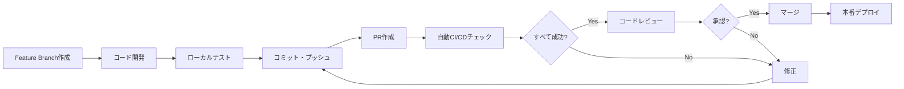

# CI/CD 運用ガイドライン

## 🎯 概要

このドキュメントは、React Firebase アプリケーションのCI/CDパイプラインの日常運用に関するガイドラインです。

---

## 🔄 開発ワークフロー

### 1. 標準的な開発フロー



### 2. ブランチ戦略

```bash
main              # 本番環境 (保護されたブランチ)
├── feature/xxx   # 機能開発
├── bugfix/xxx    # バグ修正
├── hotfix/xxx    # 緊急修正
└── docs/xxx      # ドキュメント更新
```

---

## 📋 CI/CD パイプライン詳細

### 自動実行されるワークフロー

| ワークフロー | トリガー | 実行内容 |
|-------------|---------|----------|
| **CI/CD Pipeline** | push (main, develop) | 完全なテスト・ビルド・デプロイ |
| **Branch Protection** | PR作成・更新 | 必須チェック実行 |
| **Preview Deployment** | PR作成・更新 | プレビュー環境デプロイ |
| **PR Automation** | PR操作 | 自動ラベル・サマリー生成 |

### 必須チェック項目

1. **📝 Static Analysis**
   - TypeScript型チェック
   - ESLint ルール確認
   - 実行時間: 30秒

2. **🧪 Unit Tests**
   - ユニットテスト実行
   - 実行時間: 60秒

3. **📚 Component Tests**
   - Storybook ビルド確認
   - 実行時間: 120秒

4. **🎭 E2E Tests**
   - Playwright E2E テスト
   - 実行時間: 180秒

5. **🔒 Security Scan**
   - 依存関係脆弱性チェック
   - npm audit 実行
   - 実行時間: 30秒

---

## 🚨 トラブルシューティング

### よくある問題と対処法

#### 1. TypeScript エラー

**エラー例**:
```
src/components/Login.tsx(25,5): error TS2322: Type 'string' is not assignable to type 'number'
```

**対処法**:
```bash
# ローカルで型チェック実行
npm run type-check

# エラー修正後
git add .
git commit -m "fix: resolve TypeScript errors"
git push
```

#### 2. ESLint エラー

**エラー例**:
```
error: Unexpected console statement (no-console)
```

**対処法**:
```bash
# ローカルでESLint実行
npm run lint

# 自動修正可能な場合
npm run lint -- --fix

# 手動修正後
git add .
git commit -m "fix: resolve ESLint errors"
git push
```

#### 3. E2E テスト失敗

**エラー例**:
```
Test timeout: Element not found
```

**対処法**:
```bash
# ローカルでE2Eテスト実行
npm run build
npm run test:e2e

# 失敗した場合、レポートを確認
npm run test:e2e:report

# テスト修正後
git add e2e/
git commit -m "fix: update E2E test selectors"
git push
```

#### 4. Storybook ビルド失敗

**エラー例**:
```
Module not found: Error: Can't resolve './Component'
```

**対処法**:
```bash
# ローカルでStorybookビルド確認
npm run build-storybook

# 依存関係の問題を解決
npm ci

# コンポーネントパスを修正
git add src/
git commit -m "fix: resolve Storybook build errors"
git push
```

#### 5. Firebase デプロイエラー

**エラー例**:
```
Error: HTTP Error: 403, The caller does not have permission
```

**対処法**:
1. Firebase Service Account の権限確認
2. GitHub Secrets の設定確認
3. Firebase プロジェクト設定確認

---

## 🔧 メンテナンス作業

### 定期的なメンテナンス

#### 週次作業

- [ ] **依存関係更新確認**
  ```bash
  npm outdated
  npm audit
  ```

- [ ] **CI/CD実行時間監視**
  - 各ジョブの実行時間を確認
  - 5分を超える場合は最適化検討

- [ ] **失敗率監視**
  - GitHub Actions の Success Rate 確認
  - 90%を下回る場合は原因調査

#### 月次作業

- [ ] **セキュリティアップデート**
  ```bash
  npm audit fix
  git add package*.json
  git commit -m "chore: security updates"
  ```

- [ ] **未使用の Secrets 削除**
  - GitHub Settings で使われていない Secrets を確認・削除

- [ ] **ワークフロー最適化**
  - 実行時間の長いジョブを最適化
  - キャッシュの効果を確認

### 緊急メンテナンス

#### 本番環境障害時

1. **即座に実行**
   ```bash
   # ロールバック用のhotfixブランチ作成
   git checkout main
   git pull origin main
   git checkout -b hotfix/rollback-to-stable
   
   # 安定版に戻す
   git revert <問題のコミットハッシュ>
   git push origin hotfix/rollback-to-stable
   ```

2. **緊急PR作成**
   - ブランチ保護を一時的に回避可能
   - レビューを簡素化
   - 修正後は通常フローに戻す

---

## 📊 監視とメトリクス

### KPI (Key Performance Indicators)

#### 開発効率
- **デプロイ頻度**: 週あたりのmainブランチマージ回数
- **リードタイム**: PRオープンからマージまでの時間
- **修正時間**: バグ発見から修正マージまでの時間

#### 品質メトリクス
- **テストカバレッジ**: 80%以上を維持
- **E2Eテスト成功率**: 95%以上を目標
- **セキュリティアラート**: 0件を維持

#### パフォーマンス
- **CI実行時間**: 5分以内を目標
- **ビルド成功率**: 98%以上を維持
- **デプロイ時間**: 3分以内を目標

### 監視ツール

1. **GitHub Actions Dashboard**
   - ワークフロー実行状況
   - 失敗傾向の分析

2. **Firebase Console**
   - ホスティング使用量
   - パフォーマンス監視

3. **Dependabot Alerts**
   - セキュリティ脆弱性監視
   - 依存関係アップデート通知

---

## 👥 チーム運用ルール

### コードレビューガイドライン

#### レビュアーの責任
- [ ] 機能要件の確認
- [ ] コード品質の確認
- [ ] セキュリティ観点の確認
- [ ] パフォーマンス影響の確認
- [ ] テストカバレッジの確認

#### レビュー承認基準
- ✅ すべての自動チェックが成功
- ✅ コードスタイルがプロジェクトに準拠
- ✅ 適切なテストが含まれている
- ✅ セキュリティリスクがない
- ✅ パフォーマンスに悪影響がない

### コミットメッセージルール

```bash
# 形式
<type>(<scope>): <subject>

# 例
feat(auth): add password reset functionality
fix(ui): resolve mobile responsiveness issue
docs(readme): update setup instructions
test(e2e): add login flow tests
chore(deps): update React to v18.2.0
```

#### Type一覧
- **feat**: 新機能
- **fix**: バグ修正
- **docs**: ドキュメント
- **test**: テスト
- **chore**: 雑務
- **refactor**: リファクタリング
- **style**: コードスタイル
- **perf**: パフォーマンス改善

---

## 🔐 セキュリティ運用

### Secrets管理

#### 定期的な更新
- [ ] **四半期毎**: Firebase Service Account ローテーション
- [ ] **年次**: API キーの更新確認
- [ ] **随時**: 漏洩時の即座無効化

#### アクセス権限管理
- [ ] 最小権限の原則
- [ ] 定期的な権限レビュー
- [ ] 退職者のアクセス即座削除

### 脆弱性対応

#### 対応プロセス
1. **発見**: Dependabot Alert または手動発見
2. **評価**: 影響度・緊急度の評価
3. **対応**: パッチ適用またはワークアラウンド
4. **テスト**: 修正の動作確認
5. **デプロイ**: 緊急度に応じたリリース

#### 緊急度レベル
- **Critical**: 即座対応 (24時間以内)
- **High**: 優先対応 (1週間以内)
- **Medium**: 通常対応 (1ヶ月以内)
- **Low**: 計画対応 (次回メジャーアップデート時)

---

## 📞 サポート・エスカレーション

### 問題報告

#### 開発者向け
1. **GitHub Issues** でバグ報告
2. **GitHub Discussions** で質問・議論
3. **Slack/Teams** で緊急時連絡

#### 管理者向け
1. **GitHub Repository Settings** での設定変更
2. **Firebase Console** でのインフラ管理
3. **Monitoring Tools** でのアラート設定

### エスカレーション基準

- **レベル1**: 開発者間での解決
- **レベル2**: テックリード・シニア開発者への相談
- **レベル3**: システム管理者・DevOpsエンジニアへの依頼
- **レベル4**: 外部ベンダー・サポートへの問い合わせ

---

## ✅ 運用チェックリスト

### 日次チェック
- [ ] CI/CDパイプラインの成功率確認
- [ ] 失敗したワークフローの原因調査
- [ ] セキュリティアラートの確認

### 週次チェック
- [ ] デプロイ頻度・リードタイムの確認
- [ ] テストカバレッジの確認
- [ ] 依存関係の脆弱性チェック

### 月次チェック
- [ ] KPIレポートの作成
- [ ] ワークフロー最適化の検討
- [ ] 運用ルールの見直し

---

## 🎉 運用開始

この運用ガイドラインに従って、安定した高品質なCI/CDパイプラインを維持していきましょう！

**参考ドキュメント**:
- [GitHub Actions セットアップガイド](./GITHUB_ACTIONS_SETUP.md)
- [ブランチ保護設定ガイド](./BRANCH_PROTECTION_SETUP.md)
- [CI/CD基本概念ガイド](./CICD_GUIDE.md)