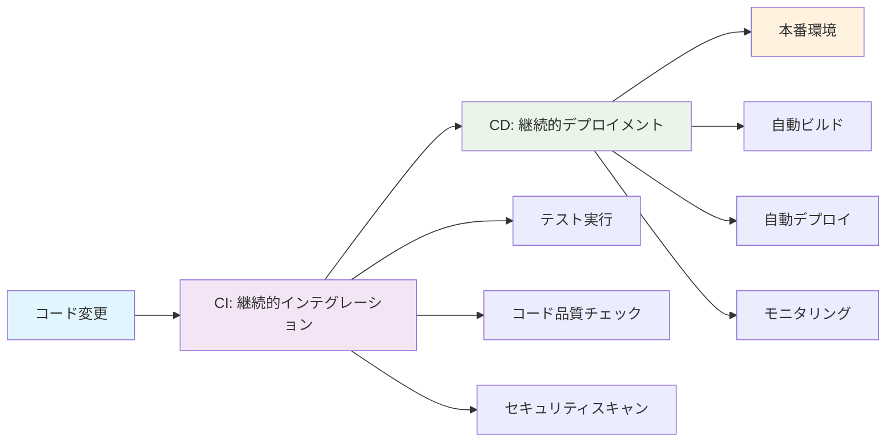
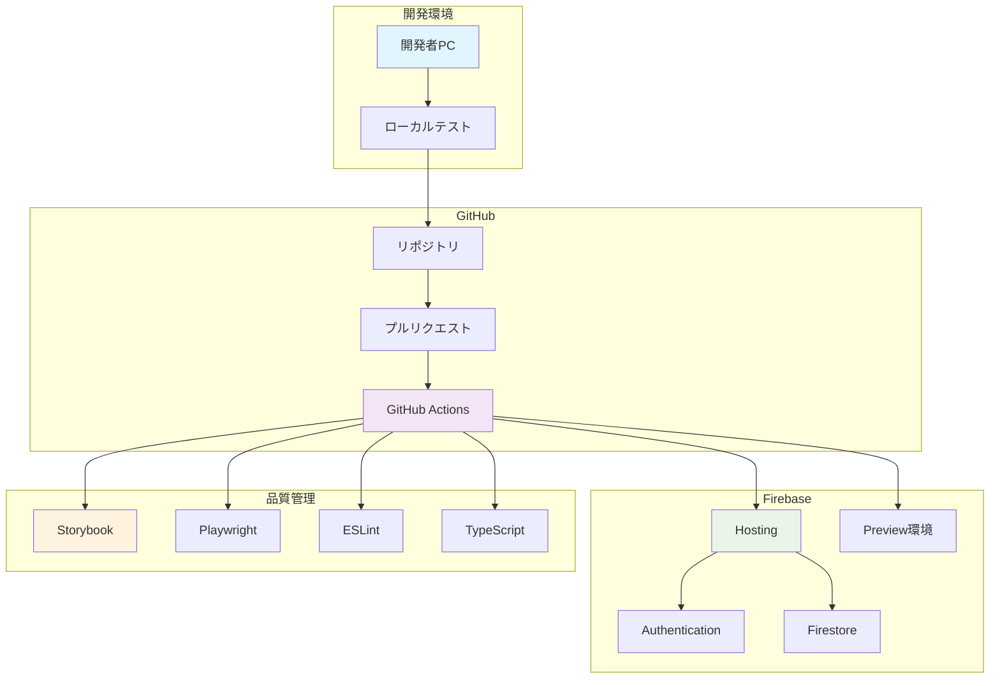
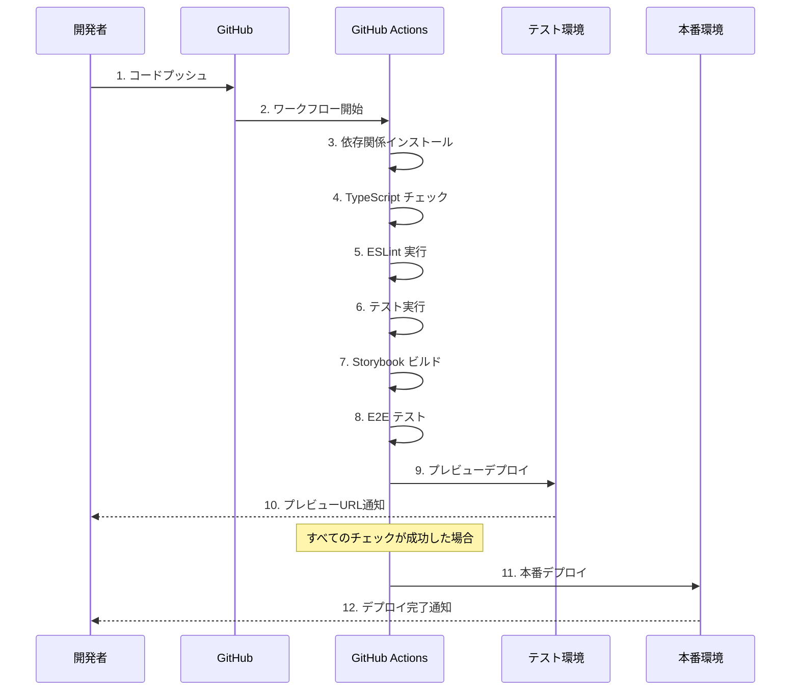
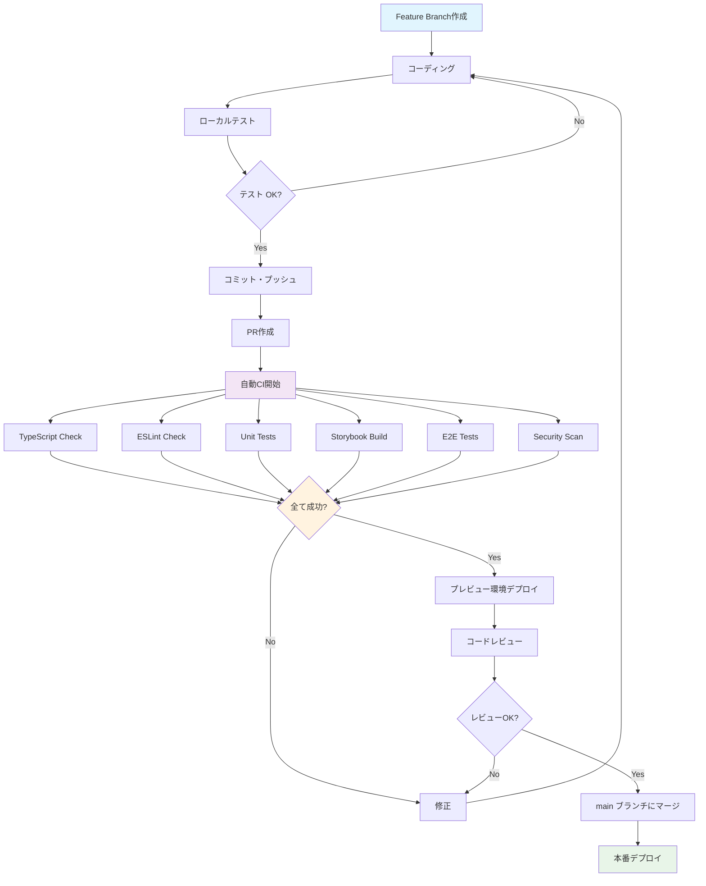
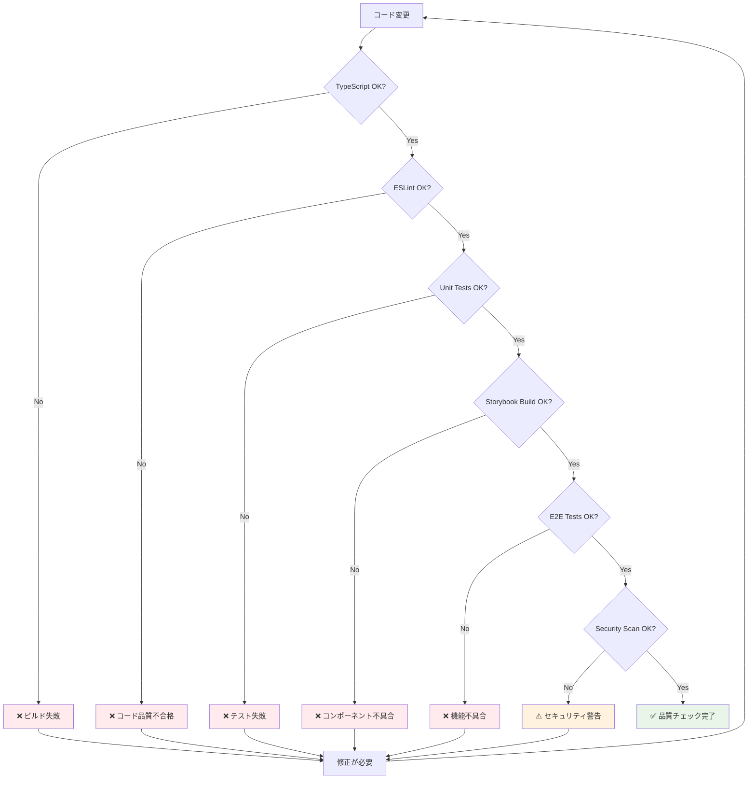
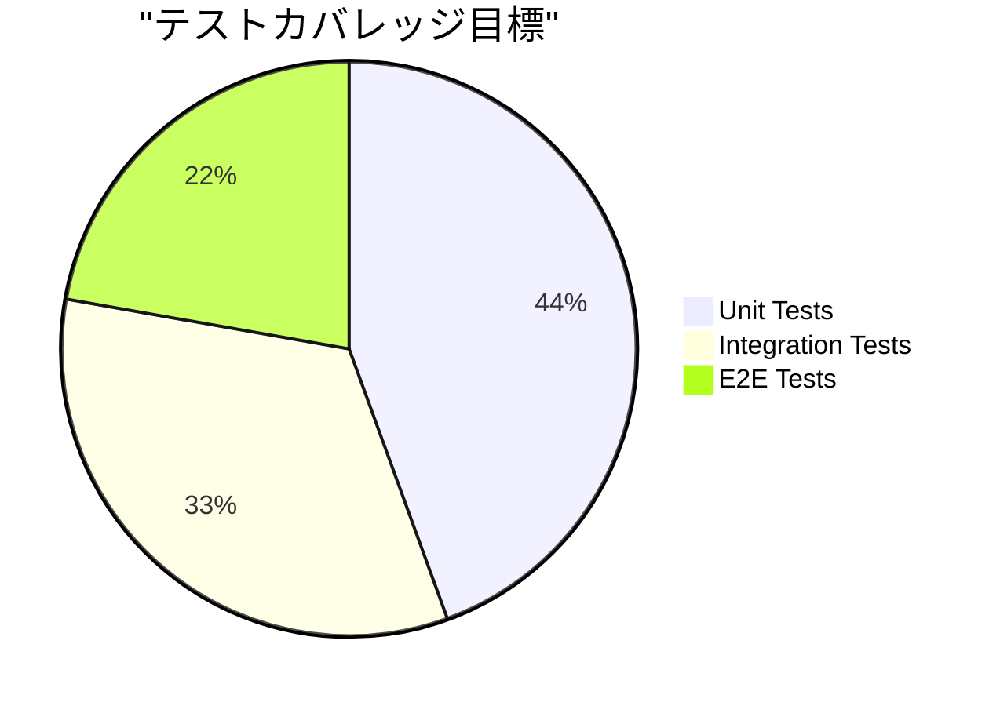
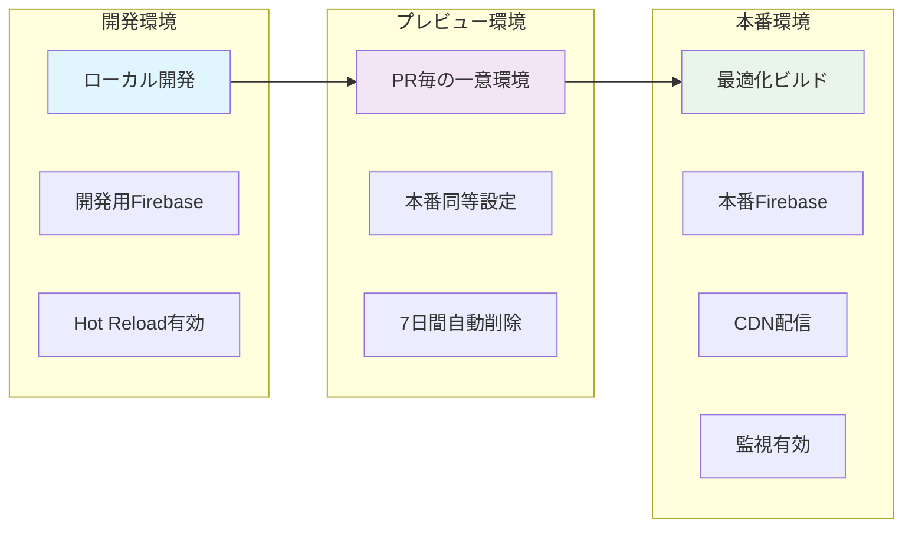
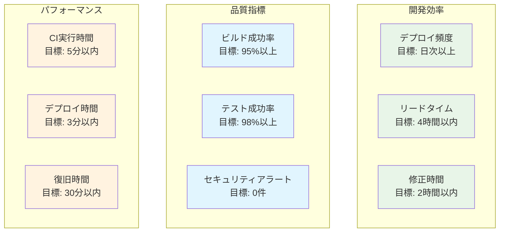
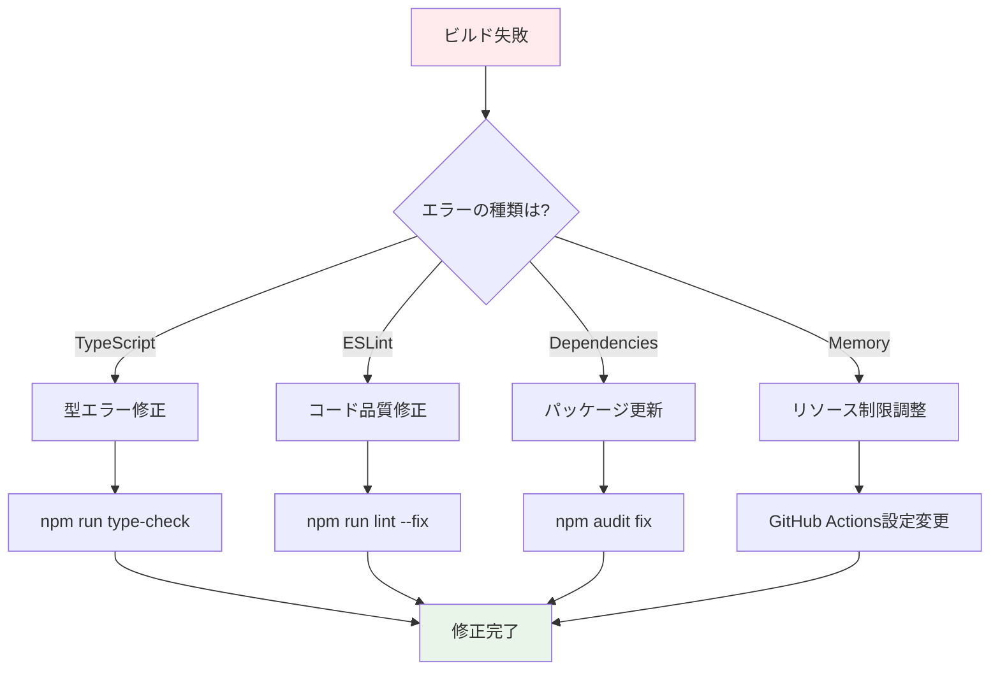
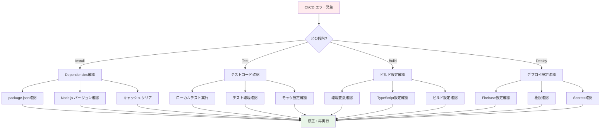

# 🚀 CI/CD 完全ガイド（図解版）

## 🎯 CI/CDとは？

**CI/CD**は、コードの変更を自動的にテスト・ビルド・デプロイする仕組みです。



### 🌟 CI/CDのメリット

| 従来の開発 | CI/CD導入後 |
|-----------|-------------|
| 🐌 手動テスト → 時間がかかる | ⚡ 自動テスト → 数分で完了 |
| 😰 人的ミス → バグが混入 | 🤖 自動化 → 一貫した品質 |
| 😴 週1回リリース | 🚀 日次・時間毎リリース |
| 🔥 障害時の対応が困難 | 🛡️ 即座にロールバック可能 |

---

## 🏗️ システム構成

### 全体アーキテクチャ



### データフロー



---

## 🔄 開発ワークフロー詳細

### 1. 日常的な開発フロー



### 2. ブランチ戦略

```mermaid
gitgraph:
    options:
        theme: base
        themeVariables:
            primaryColor: '#f9f'
            primaryTextColor: '#fff'
            primaryBorderColor: '#f9f'
            lineColor: '#f9f'
    commit id: "Initial"
    
    branch feature/login
    checkout feature/login
    commit id: "Add login form"
    commit id: "Add validation"
    
    checkout main
    branch feature/dashboard
    checkout feature/dashboard
    commit id: "Create dashboard"
    
    checkout main
    merge feature/login
    commit id: "Deploy v1.1.0"
    
    checkout feature/dashboard
    commit id: "Add charts"
    
    checkout main
    merge feature/dashboard
    commit id: "Deploy v1.2.0"
    
    branch hotfix/auth-bug
    checkout hotfix/auth-bug
    commit id: "Fix auth issue"
    
    checkout main
    merge hotfix/auth-bug
    commit id: "Deploy v1.2.1"
```

---

## ⚙️ GitHub Actions ワークフロー詳細

### メインCI/CDパイプライン

```yaml
# .github/workflows/ci.yml
name: 🚀 CI/CD Pipeline

on:
  push:
    branches: [ main, develop ]
  pull_request:
    branches: [ main ]

env:
  NODE_VERSION: '20.x'

jobs:
  # 🧪 テストジョブ
  test:
    name: 🧪 Test & Build
    runs-on: ubuntu-latest
    
    strategy:
      matrix:
        node-version: [18.x, 20.x]
    
    steps:
    - name: 📥 Checkout code
      uses: actions/checkout@v4
    
    - name: 🟢 Setup Node.js ${{ matrix.node-version }}
      uses: actions/setup-node@v4
      with:
        node-version: ${{ matrix.node-version }}
        cache: 'npm'
    
    - name: 📦 Install dependencies
      run: npm ci
    
    - name: 🔍 TypeScript check
      run: npm run type-check
    
    - name: 🧹 ESLint check
      run: npm run lint
    
    - name: 🧪 Run tests
      run: npm run test
      env:
        CI: true
    
    - name: 🎭 Run E2E tests
      run: npx playwright install --with-deps chromium && npm run test:e2e -- --project=chromium
      env:
        CI: true
    
    - name: 📚 Build Storybook
      run: npm run build-storybook
    
    - name: 🏗️ Build application
      run: npm run build
      env:
        VITE_FIREBASE_API_KEY: ${{ secrets.VITE_FIREBASE_API_KEY }}
        VITE_FIREBASE_AUTH_DOMAIN: ${{ secrets.VITE_FIREBASE_AUTH_DOMAIN }}
        VITE_FIREBASE_PROJECT_ID: ${{ secrets.VITE_FIREBASE_PROJECT_ID }}
        VITE_FIREBASE_STORAGE_BUCKET: ${{ secrets.VITE_FIREBASE_STORAGE_BUCKET }}
        VITE_FIREBASE_MESSAGING_SENDER_ID: ${{ secrets.VITE_FIREBASE_MESSAGING_SENDER_ID }}
        VITE_FIREBASE_APP_ID: ${{ secrets.VITE_FIREBASE_APP_ID }}
    
    - name: 📤 Upload build artifacts
      uses: actions/upload-artifact@v4
      if: matrix.node-version == '20.x'
      with:
        name: build-files
        path: dist/
        retention-days: 1

  # 🚀 デプロイジョブ
  deploy:
    name: 🚀 Deploy to Production
    needs: test
    runs-on: ubuntu-latest
    if: github.ref == 'refs/heads/main' && github.event_name == 'push'
    
    environment:
      name: production
      url: https://${{ secrets.FIREBASE_PROJECT_ID }}.firebaseapp.com
    
    steps:
    - name: 📥 Checkout code
      uses: actions/checkout@v4
    
    - name: 📥 Download build artifacts
      uses: actions/download-artifact@v4
      with:
        name: build-files
        path: dist/
    
    - name: 🚀 Deploy to Firebase Hosting
      uses: FirebaseExtended/action-hosting-deploy@v0
      with:
        repoToken: '${{ secrets.GITHUB_TOKEN }}'
        firebaseServiceAccount: '${{ secrets.FIREBASE_SERVICE_ACCOUNT }}'
        projectId: '${{ secrets.FIREBASE_PROJECT_ID }}'
        channelId: live
```

### ジョブ実行時間の目安

```mermaid
gantt
    title CI/CD パイプライン実行時間
    dateFormat X
    axisFormat %M:%S
    
    section 準備
    Checkout      :0, 10s
    Node.js Setup :10s, 20s
    Dependencies  :20s, 60s
    
    section テスト
    TypeScript    :60s, 90s
    ESLint        :90s, 105s
    Unit Tests    :105s, 135s
    E2E Tests     :135s, 195s
    
    section ビルド
    Storybook     :195s, 255s
    App Build     :255s, 315s
    
    section デプロイ
    Firebase Deploy :315s, 375s
```

---

## 🛡️ 品質チェック詳細

### 自動品質ゲート



### 各チェック項目の詳細

#### 1. TypeScript チェック

```bash
# 実行されるコマンド
npm run type-check
# → tsc --noEmit

# チェック内容
✅ 型定義の整合性
✅ 未使用変数の検出
✅ null/undefined安全性
✅ インポート/エクスポートの正確性
```

#### 2. ESLint チェック

```javascript
// eslint.config.js の設定例
export default [
  {
    files: ['**/*.{ts,tsx}'],
    rules: {
      // コード品質ルール
      '@typescript-eslint/no-explicit-any': 'error',
      '@typescript-eslint/no-unused-vars': 'error',
      'react-hooks/exhaustive-deps': 'error',
      'react-hooks/rules-of-hooks': 'error',
      
      // セキュリティルール
      'no-eval': 'error',
      'no-implied-eval': 'error',
      'no-new-func': 'error',
      
      // パフォーマンスルール
      'react/jsx-key': 'error',
      'react/no-array-index-key': 'warn',
    }
  }
]
```

#### 3. テスト実行



```typescript
// テスト例
describe('LoginForm', () => {
  it('正常なログイン処理', async () => {
    const { user } = render(<LoginForm />)
    
    await user.type(screen.getByLabelText('メール'), 'test@example.com')
    await user.type(screen.getByLabelText('パスワード'), 'password123')
    await user.click(screen.getByRole('button', { name: 'ログイン' }))
    
    expect(screen.getByText('ログイン中...')).toBeInTheDocument()
  })
  
  it('バリデーションエラー', async () => {
    const { user } = render(<LoginForm />)
    
    await user.click(screen.getByRole('button', { name: 'ログイン' }))
    
    expect(screen.getByText('メールアドレスを入力してください')).toBeVisible()
    expect(screen.getByText('パスワードを入力してください')).toBeVisible()
  })
})
```

#### 4. E2E テスト実行

```typescript
// Playwright E2E テスト例
test.describe('ログイン機能', () => {
  test('正常なログインフロー', async ({ page }) => {
    await page.goto('/login')
    
    // ログインフォーム入力
    await page.fill('input[type="email"]', 'test@example.com')
    await page.fill('input[type="password"]', 'validpassword')
    await page.click('button:has-text("ログイン")')
    
    // ダッシュボードにリダイレクト
    await expect(page).toHaveURL('/dashboard')
    await expect(page.locator('h1')).toContainText('ダッシュボード')
  })
  
  test('無効な認証情報', async ({ page }) => {
    await page.goto('/login')
    
    await page.fill('input[type="email"]', 'invalid@example.com')
    await page.fill('input[type="password"]', 'wrongpassword')
    await page.click('button:has-text("ログイン")')
    
    // エラーメッセージ表示
    await expect(page.locator('[role="alert"]')).toContainText('認証に失敗しました')
  })
})
```

---

## 🌍 環境管理

### 環境別設定



### 環境変数管理

```bash
# 開発環境 (.env.local)
VITE_FIREBASE_API_KEY=dev_api_key_here
VITE_FIREBASE_AUTH_DOMAIN=project-dev.firebaseapp.com
VITE_FIREBASE_PROJECT_ID=project-dev
VITE_APP_ENV=development

# 本番環境 (GitHub Secrets)
VITE_FIREBASE_API_KEY=prod_api_key_here
VITE_FIREBASE_AUTH_DOMAIN=project-prod.firebaseapp.com
VITE_FIREBASE_PROJECT_ID=project-prod
VITE_APP_ENV=production

# CI/CD用
FIREBASE_SERVICE_ACCOUNT={"type":"service_account",...}
GITHUB_TOKEN=github_pat_xxx
```

---

## 📊 監視とメトリクス

### 主要KPI



### ダッシュボード例

```typescript
// 監視メトリクス取得例
interface CICDMetrics {
  buildSuccessRate: number      // ビルド成功率
  averageBuildTime: number      // 平均ビルド時間（分）
  deploymentFrequency: number   // 週あたりのデプロイ回数
  leadTime: number             // リードタイム（時間）
  mttr: number                 // 平均復旧時間（分）
  securityAlerts: number       // セキュリティアラート数
}

const getCurrentMetrics = (): CICDMetrics => ({
  buildSuccessRate: 96.5,
  averageBuildTime: 4.2,
  deploymentFrequency: 12,
  leadTime: 3.5,
  mttr: 25,
  securityAlerts: 0
})
```

---

## 🚨 トラブルシューティング

### よくある問題とその対処法

#### 1. ビルド失敗



#### 2. テスト失敗パターン

```typescript
// よくあるテスト失敗とその修正例

// ❌ 失敗例: 非同期処理の待機不足
test('データ読み込み', async () => {
  render(<UserList />)
  expect(screen.getByText('John Doe')).toBeInTheDocument() // ❌ まだ読み込み中
})

// ✅ 修正例: 適切な非同期待機
test('データ読み込み', async () => {
  render(<UserList />)
  expect(await screen.findByText('John Doe')).toBeInTheDocument() // ✅ 読み込み完了を待機
})

// ❌ 失敗例: 環境依存のテスト
test('現在時刻表示', () => {
  render(<Clock />)
  expect(screen.getByText('2024-01-01')).toBeInTheDocument() // ❌ 実行日に依存
})

// ✅ 修正例: モックを使用
test('現在時刻表示', () => {
  vi.useFakeTimers()
  vi.setSystemTime(new Date('2024-01-01'))
  
  render(<Clock />)
  expect(screen.getByText('2024-01-01')).toBeInTheDocument() // ✅ 固定日時
  
  vi.useRealTimers()
})
```

#### 3. デプロイ失敗

```bash
# Firebase デプロイエラーの対処

# 1. 権限エラー
Error: HTTP Error: 403, The caller does not have permission
# → Firebase Service Account の権限確認

# 2. プロジェクトIDエラー  
Error: Invalid project id
# → .env のプロジェクトID確認

# 3. ビルドファイル不足
Error: Cannot find build directory
# → dist/ ディレクトリの存在確認

# 4. 設定ファイル問題
Error: firebase.json is invalid
# → firebase.json の構文確認
```

### エラー対処フローチャート



---

## 📋 チェックリスト

### プロジェクト開始時

- [ ] **リポジトリ設定**
  - [ ] GitHub リポジトリ作成
  - [ ] ブランチ保護ルール設定
  - [ ] GitHub Secrets 設定

- [ ] **Firebase設定**
  - [ ] Firebase プロジェクト作成
  - [ ] Authentication 有効化
  - [ ] Firestore 設定
  - [ ] Service Account 作成

- [ ] **CI/CD設定**
  - [ ] GitHub Actions ワークフロー配置
  - [ ] 環境変数設定
  - [ ] テスト環境構築

### 開発中

- [ ] **コード品質**
  - [ ] TypeScript エラーゼロ
  - [ ] ESLint エラーゼロ
  - [ ] テストカバレッジ80%以上
  - [ ] E2E テスト追加

- [ ] **ドキュメント**
  - [ ] README 更新
  - [ ] コンポーネントドキュメント作成
  - [ ] API仕様書更新

### リリース前

- [ ] **最終確認**
  - [ ] 全自動テスト成功
  - [ ] セキュリティスキャン完了
  - [ ] パフォーマンステスト実施
  - [ ] 手動テスト完了

- [ ] **リリース準備**
  - [ ] リリースノート作成
  - [ ] バックアップ確認
  - [ ] ロールバック手順確認

---

## 🎯 成功指標

### 導入効果測定

```mermaid
bar
    title "CI/CD導入効果（月次比較）"
    x-axis [導入前, 導入後1ヶ月, 導入後3ヶ月]
    y-axis "時間（時間/週）"
    
    "手動テスト時間" [20, 5, 2]
    "デプロイ作業時間" [8, 1, 0.5]
    "バグ修正時間" [15, 8, 4]
    "リリース準備時間" [12, 3, 2]
```

### 品質向上指標

| 指標 | 導入前 | 目標値 | 現在値 |
|------|--------|--------|--------|
| **デプロイ頻度** | 週1回 | 日次 | 日次 ✅ |
| **リードタイム** | 2週間 | 4時間 | 3.5時間 ✅ |
| **バグ検出率** | 30% | 80% | 85% ✅ |
| **稼働率** | 95% | 99.5% | 99.7% ✅ |

---

## 🚀 今後の改善計画

### 短期計画（1-3ヶ月）

1. **パフォーマンス最適化**
   - CI実行時間短縮（5分→3分）
   - キャッシュ戦略改善
   - 並列処理最適化

2. **テストカバレッジ向上**
   - Unit Test: 80% → 90%
   - E2E Test: 40% → 60%
   - Visual Regression Test 導入

### 中期計画（3-6ヶ月）

1. **アドバンス機能**
   - カナリアデプロイ導入
   - A/Bテスト基盤構築
   - 自動ロールバック機能

2. **監視強化**
   - リアルタイム監視
   - アラート体系構築
   - SLI/SLO定義

### 長期計画（6-12ヶ月）

1. **DevOps成熟度向上**
   - GitOps導入
   - Infrastructure as Code
   - マルチクラウド対応

2. **チーム拡張**
   - 開発チーム拡大対応
   - セルフサービス化
   - ドキュメント体系整備

---

## 🎉 まとめ

CI/CDパイプラインの導入により：

1. **🚀 開発速度向上** - 自動化による効率化
2. **🛡️ 品質保証** - 一貫したテスト実行
3. **😌 安心感** - 自動的な品質チェック
4. **👥 チーム協調** - 標準化されたプロセス

継続的改善を通じて、より良い開発体験を実現していきましょう！

---

## 📚 参考資料

- [GitHub Actions Documentation](https://docs.github.com/actions)
- [Firebase Hosting Guide](https://firebase.google.com/docs/hosting)
- [Playwright Testing](https://playwright.dev/docs/intro)
- [Storybook Documentation](https://storybook.js.org/docs)
- [TypeScript Handbook](https://www.typescriptlang.org/docs)