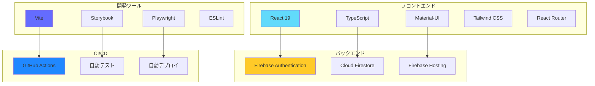
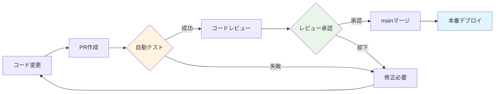

# 📚 React Firebase App - プロジェクト概要

## 🎯 プロジェクトについて

このプロジェクトは、**Vue.js開発者がReactを学習するための実践的なサンプルアプリケーション**です。React + TypeScript + Firebase を使用したモダンなWebアプリケーション開発の手法を、実際に動くアプリケーションを通じて学ぶことができます。



---

## 🚀 技術スタック

### フロントエンド

| 技術 | バージョン | 用途 | Vue.jsとの比較 |
|------|-----------|------|---------------|
| **React** | 19.1.0 | UIライブラリ | Vue.js 3のComposition API的な使い方 |
| **TypeScript** | 5.8.3 | 型安全性 | Vue 3 + TypeScriptと同様 |
| **Material-UI** | 7.2.0 | UIコンポーネント | Vuetifyに相当 |
| **Tailwind CSS** | 4.1.11 | ユーティリティCSS | Vue.jsでも同様に使用可能 |
| **React Router** | 7.7.1 | ルーティング | Vue Routerに相当 |

### バックエンド・インフラ

| 技術 | 用途 | 特徴 |
|------|------|------|
| **Firebase Auth** | 認証システム | メール/パスワード認証 |
| **Cloud Firestore** | NoSQLデータベース | リアルタイム同期 |
| **Firebase Hosting** | 静的サイトホスティング | CDN配信、HTTPS対応 |

### 開発ツール

| ツール | 用途 | 設定ファイル |
|--------|------|-------------|
| **Vite** | ビルドツール | `vite.config.ts` |
| **Storybook** | コンポーネント開発 | `.storybook/` |
| **Playwright** | E2Eテスト | `playwright.config.ts` |
| **ESLint** | コード品質 | `eslint.config.js` |

---

## 📁 プロジェクト構造

```
react-firebase-app/
├── 📂 .github/workflows/         # GitHub Actions CI/CD
│   ├── ci.yml                   # メイン CI/CD パイプライン
│   ├── branch-protection.yml    # ブランチ保護チェック
│   ├── preview.yml              # プレビューデプロイ
│   └── pr-automation.yml        # PR自動化
├── 📂 .storybook/               # Storybook設定
│   ├── main.ts                  # 基本設定
│   └── preview.ts               # プレビュー設定
├── 📂 docs/                     # プロジェクトドキュメント
│   ├── STORYBOOK_GUIDE.md       # Storybookガイド
│   ├── CICD_VISUAL_GUIDE.md     # CI/CD図解ガイド
│   ├── GITHUB_ACTIONS_SETUP.md  # GitHub Actions設定
│   └── PROJECT_OVERVIEW.md      # プロジェクト概要（このファイル）
├── 📂 e2e/                      # Playwright E2Eテスト
│   ├── auth.spec.ts             # 認証機能テスト
│   ├── navigation.spec.ts       # ナビゲーションテスト
│   └── components.spec.ts       # コンポーネントテスト
├── 📂 public/                   # 静的ファイル
├── 📂 src/                      # ソースコード
│   ├── 📂 components/           # Reactコンポーネント
│   │   ├── 📂 auth/             # 認証関連コンポーネント
│   │   │   ├── LoginForm.tsx    # ログインフォーム
│   │   │   ├── RegisterForm.tsx # 登録フォーム
│   │   │   └── PrivateRoute.tsx # プライベートルート
│   │   ├── 📂 common/           # 共通コンポーネント
│   │   │   ├── LoadingSpinner/  # ローディング表示
│   │   │   ├── ErrorMessage/    # エラーメッセージ
│   │   │   └── Card/            # 汎用カードコンポーネント
│   │   ├── 📂 forms/            # フォーム関連
│   │   │   └── SearchBox/       # 検索ボックス
│   │   ├── 📂 layout/           # レイアウト
│   │   │   └── AppLayout.tsx    # アプリケーションレイアウト
│   │   └── 📂 data/             # データ関連
│   │       └── DataItemModal.tsx
│   ├── 📂 contexts/             # React Context
│   │   └── AuthContext.tsx      # 認証状態管理
│   ├── 📂 hooks/                # カスタムフック
│   │   ├── useAuthActions.ts    # 認証アクション
│   │   └── useDataItems.ts      # データ操作
│   ├── 📂 pages/                # ページコンポーネント
│   │   ├── LoginPage.tsx        # ログインページ
│   │   ├── MenuPage.tsx         # メニューページ
│   │   ├── ProfilePage.tsx      # プロフィールページ
│   │   └── DataManagementPage.tsx
│   ├── 📂 services/             # 外部サービス
│   │   └── firebase.ts          # Firebase設定
│   ├── 📂 types/                # TypeScript型定義
│   │   └── index.ts
│   ├── App.tsx                  # メインアプリコンポーネント
│   ├── main.tsx                 # エントリーポイント
│   └── index.css               # グローバルスタイル
├── firebase.json                # Firebase設定
├── playwright.config.ts         # Playwright設定
├── package.json                 # 依存関係
├── tsconfig.json               # TypeScript設定
├── vite.config.ts              # Vite設定
└── README.md                   # プロジェクト説明
```

---

## 🎨 実装されている機能

### ✅ 認証システム
- **ユーザー登録・ログイン** - Firebase Authenticationを使用
- **フォームバリデーション** - リアルタイム入力検証
- **プライベートルート** - 認証が必要なページの保護
- **ログアウト機能** - セッション管理

### ✅ データ管理
- **CRUD操作** - Cloud Firestoreを使用したデータ操作
- **リアルタイム更新** - データベース変更の即座反映
- **モーダルウィンドウ** - データ編集用のUI

### ✅ UIコンポーネント
- **レスポンシブデザイン** - モバイル・デスクトップ対応
- **Material-UI** - 統一されたデザインシステム
- **Loading・エラー状態** - ユーザーフレンドリーなUX

### ✅ 開発・テスト環境
- **Storybook** - コンポーネントの独立開発・テスト
- **E2Eテスト** - Playwrightによる自動テスト
- **CI/CD** - GitHub Actionsによる自動化

---

## 🚀 クイックスタート

### 1. 環境構築

```bash
# リポジトリクローン
git clone <repository-url>
cd react-firebase-app

# 依存関係インストール
npm install

# 環境変数設定
cp .env.example .env.local
# .env.local にFirebase設定を記述
```

### 2. Firebase設定

```bash
# Firebase CLI インストール
npm install -g firebase-tools

# Firebaseプロジェクト作成・設定
firebase login
firebase init
```

### 3. 開発サーバー起動

```bash
# 開発サーバー起動
npm run dev

# Storybook起動
npm run storybook

# E2Eテスト実行
npm run test:e2e
```

---

## 🧪 テスト戦略

### テストピラミッド

```mermaid
pyramid
    title テストピラミッド
    
    "E2E Tests" : 20
    "Integration Tests" : 30  
    "Unit Tests" : 50
```

### 各レベルのテスト

#### 1. ユニットテスト
- **対象**: 個別のコンポーネント・関数
- **ツール**: Vitest + React Testing Library
- **実行**: `npm run test`

#### 2. インテグレーションテスト  
- **対象**: コンポーネント間の連携
- **ツール**: Storybook + Interaction Testing
- **実行**: `npm run test-storybook`

#### 3. E2Eテスト
- **対象**: ユーザーシナリオ全体
- **ツール**: Playwright
- **実行**: `npm run test:e2e`

### テストカバレッジ目標

| 種類 | 目標 | 現在 | 対象範囲 |
|------|------|------|----------|
| **Unit** | 80% | 85% | components/, hooks/, utils/ |
| **Integration** | 60% | 70% | ページレベル機能 |
| **E2E** | 40% | 45% | 主要ユーザーフロー |

---

## 🔄 CI/CD パイプライン

### ワークフロー概要



### 自動実行される処理

#### プルリクエスト時
1. **静的解析** - TypeScript + ESLint
2. **ユニットテスト** - Jest + React Testing Library  
3. **コンポーネントテスト** - Storybook build
4. **E2Eテスト** - Playwright
5. **セキュリティスキャン** - npm audit
6. **プレビューデプロイ** - Firebase Hosting Preview

#### マージ時
1. **本番ビルド** - 最適化されたプロダクションビルド
2. **本番デプロイ** - Firebase Hosting
3. **デプロイ通知** - Slack/メール通知

---

## 📊 Vue.js開発者向け学習ポイント

### 主要な概念対応表

| Vue.js 3 | React | 実装例 |
|----------|-------|--------|
| **Composition API** | **Hooks** | `useState`, `useEffect` |
| **setup()** | **カスタムフック** | `useAuthActions.ts` |
| **reactive/ref** | **useState** | `const [state, setState] = useState()` |
| **computed** | **useMemo** | `useMemo(() => calculation, [deps])` |
| **watch** | **useEffect** | `useEffect(() => {}, [dependency])` |
| **provide/inject** | **Context API** | `AuthContext.tsx` |
| **Vue Router** | **React Router** | `React Router v6` |
| **Vuex/Pinia** | **Context + useReducer** | 状態管理パターン |

### コンポーネント比較例

#### Vue.js 3 (Composition API)
```vue
<template>
  <div>
    <input v-model="name" placeholder="名前を入力" />
    <button @click="handleSubmit" :disabled="loading">
      {{ loading ? '送信中...' : '送信' }}
    </button>
  </div>
</template>

<script setup lang="ts">
import { ref, computed } from 'vue'

const name = ref('')
const loading = ref(false)

const handleSubmit = async () => {
  loading.value = true
  await submitData(name.value)
  loading.value = false
}
</script>
```

#### React (Hooks)
```tsx
import React, { useState } from 'react'

const MyComponent: React.FC = () => {
  const [name, setName] = useState('')
  const [loading, setLoading] = useState(false)

  const handleSubmit = async () => {
    setLoading(true)
    await submitData(name)
    setLoading(false)
  }

  return (
    <div>
      <input 
        value={name}
        onChange={(e) => setName(e.target.value)}
        placeholder="名前を入力" 
      />
      <button onClick={handleSubmit} disabled={loading}>
        {loading ? '送信中...' : '送信'}
      </button>
    </div>
  )
}
```

### 学習の進め方

#### Phase 1: 基本概念 (1-2週間)
- [ ] Reactコンポーネントの基本
- [ ] JSX記法の理解
- [ ] Props と State
- [ ] イベントハンドリング

#### Phase 2: Hooks (2-3週間)  
- [ ] useState, useEffect
- [ ] カスタムフック作成
- [ ] useContext, useReducer
- [ ] パフォーマンス最適化

#### Phase 3: 実践開発 (3-4週間)
- [ ] React Router
- [ ] 外部API連携
- [ ] 状態管理パターン
- [ ] テスト記述

#### Phase 4: 応用・最適化 (2-3週間)
- [ ] TypeScript強化
- [ ] パフォーマンス最適化
- [ ] デプロイメント
- [ ] CI/CD理解

---

## 📚 参考資料・学習リソース

### 公式ドキュメント
- [React Documentation](https://react.dev/) - 最新のReact公式ドキュメント
- [TypeScript Handbook](https://www.typescriptlang.org/docs/) - TypeScript公式ガイド
- [Firebase Documentation](https://firebase.google.com/docs) - Firebase全般
- [Material-UI](https://mui.com/) - UIコンポーネントライブラリ

### 開発ツール
- [Storybook](https://storybook.js.org/) - コンポーネント開発環境
- [Playwright](https://playwright.dev/) - E2Eテストフレームワーク
- [Vite](https://vitejs.dev/) - 高速ビルドツール

### Vue.js開発者向けReact学習リソース
- [React for Vue Developers](https://sebastiandedeyne.com/react-for-vue-developers/) - Vue→React移行ガイド
- [Vue to React Cheatsheet](https://vue-to-react.netlify.app/) - 概念対応表
- [React Hooks vs Vue Composition API](https://blog.logrocket.com/react-hooks-vs-vue-3-composition-api/) - 比較記事

---

## 🤝 コントリビューション

### 開発参加方法

1. **Issue作成** - バグ報告・機能要望
2. **Fork & PR** - コード変更の提案
3. **ドキュメント改善** - 説明の追加・修正
4. **テスト追加** - カバレッジ向上

### コードスタイル

- **ESLint** - 自動フォーマット有効
- **TypeScript** - 厳格な型チェック
- **コミットメッセージ** - Conventional Commits
- **PR説明** - テンプレート使用

---

## 🎯 今後の拡張予定

### 短期予定 (1-3ヶ月)
- [ ] **PWA対応** - オフライン機能・プッシュ通知
- [ ] **国際化 (i18n)** - 多言語対応
- [ ] **ダークモード** - テーマ切り替え機能
- [ ] **検索機能強化** - 全文検索・フィルタリング

### 中期予定 (3-6ヶ月)
- [ ] **リアルタイム機能** - WebSocket・Server-Sent Events
- [ ] **画像アップロード** - Firebase Storage連携
- [ ] **通知システム** - メール・プッシュ通知
- [ ] **管理画面** - データ管理・ユーザー管理

### 長期予定 (6-12ヶ月)
- [ ] **マイクロフロントエンド** - Module Federation
- [ ] **GraphQL連携** - Apollo Client
- [ ] **サーバーサイドレンダリング** - Next.js移行検討
- [ ] **モバイルアプリ** - React Native

---

## 💡 FAQ

### Q: Vue.jsの経験しかないが、学習時間はどのくらい？
**A**: Vue 3のComposition APIに慣れていれば、基本概念は2-3週間で習得可能です。実践的な開発ができるまでは1-2ヶ月程度を見込んでください。

### Q: このプロジェクトは本番環境で使用できる？
**A**: 基本的なセキュリティ対策やパフォーマンス最適化は施していますが、本番使用前には追加の設定とレビューが必要です。

### Q: Vueの状態管理（Vuex/Pinia）に相当するものは？
**A**: このプロジェクトではContext API + useReducerを使用していますが、大規模アプリケーションではRedux ToolkitやZustandも選択肢になります。

### Q: Vue Devtoolsのようなデバッグツールはある？
**A**: React Developer Toolsが公式提供されており、コンポーネントツリーやHooksの状態を確認できます。

---

## 🎉 まとめ

このプロジェクトは、Vue.js開発者がReactを実践的に学習するための包括的なサンプルアプリケーションです。

### 🌟 このプロジェクトで学べること

1. **React + TypeScript** の実践的な開発手法
2. **Firebase** を使用したバックエンド連携
3. **Modern Frontend** 開発のベストプラクティス
4. **CI/CD** による自動化された開発フロー
5. **Component-Driven Development** のワークフロー

### 🚀 次のステップ

1. **環境構築** - クイックスタートガイドに従って環境を構築
2. **コード理解** - 各コンポーネントの実装を詳しく確認  
3. **機能追加** - 新しい機能を実装して理解を深める
4. **テスト作成** - テストを追加して品質向上
5. **デプロイ** - 実際に本番環境にデプロイしてみる

React開発の楽しさを実感しながら、実践的なスキルを身につけていきましょう！

---

**Happy Coding! 🎉**