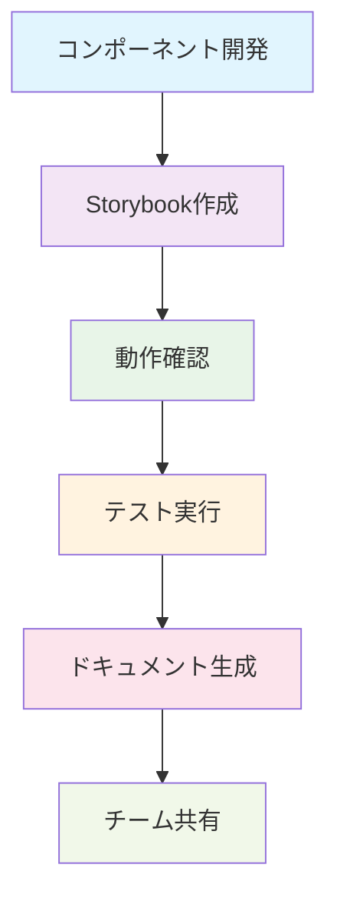
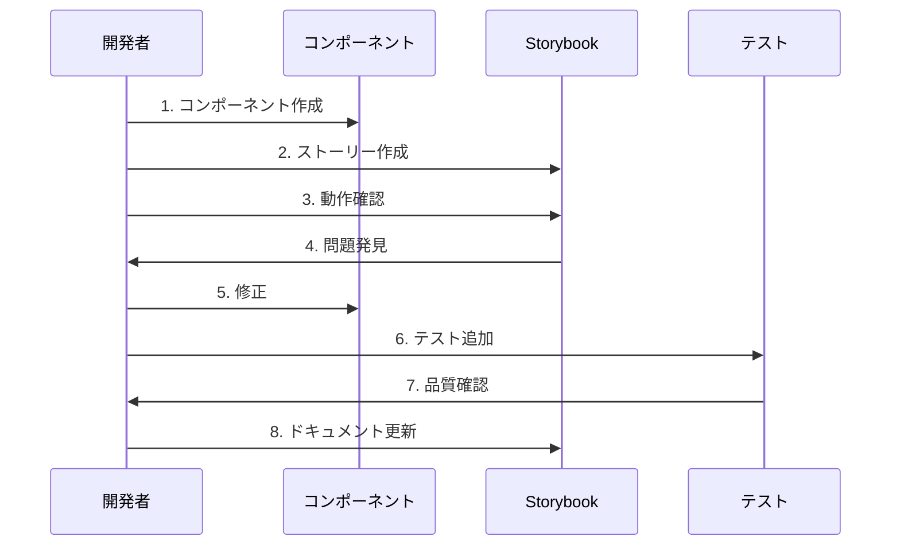
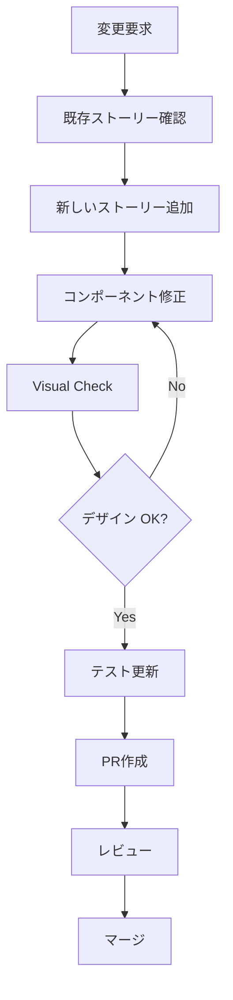
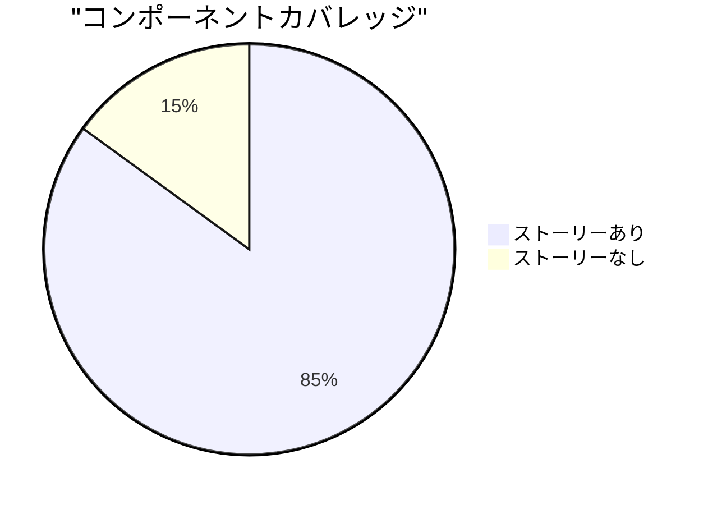

# 📚 Storybook コンポーネント開発ガイド

## 🎯 Storybookとは？

Storybookは、UIコンポーネントを独立した環境で開発・テスト・ドキュメント化するためのツールです。



### ✨ Storybookのメリット

| メリット | 説明 | 実例 |
|---------|------|------|
| **🔬 独立開発** | コンポーネントを他から切り離して開発 | ボタンだけを単体で確認 |
| **📖 自動ドキュメント** | props や使用方法を自動生成 | TypeScript型情報から自動作成 |
| **🧪 視覚的テスト** | 様々な状態を一覧で確認 | 正常・エラー・ローディング状態 |
| **👥 チーム共有** | デザイナーとの認識合わせ | 実装前のモックアップ確認 |

---

## 🚀 開発ワークフロー

### 1. コンポーネント開発の流れ



### 2. ディレクトリ構造

```
src/
├── components/
│   ├── common/
│   │   ├── Button/
│   │   │   ├── Button.tsx           # コンポーネント本体
│   │   │   ├── Button.stories.ts    # Storybookストーリー
│   │   │   ├── Button.test.tsx      # ユニットテスト
│   │   │   └── index.ts             # エクスポート
│   │   └── LoadingSpinner/
│   │       ├── LoadingSpinner.tsx
│   │       ├── LoadingSpinner.stories.ts
│   │       └── index.ts
│   ├── forms/
│   └── layout/
└── .storybook/
    ├── main.ts                      # Storybook設定
    └── preview.ts                   # プレビュー設定
```

---

## 📝 実装例とベストプラクティス

### 基本的なコンポーネント例

#### 1. ボタンコンポーネント

```tsx
// src/components/common/Button/Button.tsx
import React from 'react'
import { Button as MuiButton, ButtonProps as MuiButtonProps } from '@mui/material'

export interface ButtonProps extends Omit<MuiButtonProps, 'size'> {
  /** ボタンのサイズ */
  size?: 'small' | 'medium' | 'large'
  /** ボタンのバリアント */
  variant?: 'contained' | 'outlined' | 'text'
  /** ローディング状態かどうか */
  loading?: boolean
  /** アイコン */
  startIcon?: React.ReactNode
  /** 子要素（ボタンテキスト） */
  children: React.ReactNode
}

const Button: React.FC<ButtonProps> = ({
  size = 'medium',
  variant = 'contained',
  loading = false,
  disabled,
  children,
  ...props
}) => {
  return (
    <MuiButton
      size={size}
      variant={variant}
      disabled={disabled || loading}
      {...props}
    >
      {loading ? 'Loading...' : children}
    </MuiButton>
  )
}

export default Button
```

#### 2. 対応するStorybookストーリー

```typescript
// src/components/common/Button/Button.stories.ts
import type { Meta, StoryObj } from '@storybook/react-vite'
import Button from './Button'
import { PlayIcon, TrashIcon } from '@heroicons/react/24/outline'

const meta: Meta<typeof Button> = {
  title: 'Common/Button',
  component: Button,
  parameters: {
    layout: 'centered',
    docs: {
      description: {
        component: '再利用可能なボタンコンポーネントです。Material-UIをベースに独自のpropsを追加しています。'
      }
    }
  },
  tags: ['autodocs'],
  argTypes: {
    size: {
      control: 'select',
      options: ['small', 'medium', 'large'],
      description: 'ボタンのサイズを指定します'
    },
    variant: {
      control: 'select',
      options: ['contained', 'outlined', 'text'],
      description: 'ボタンの見た目のバリエーション'
    },
    loading: {
      control: 'boolean',
      description: 'ローディング状態の表示'
    },
    disabled: {
      control: 'boolean',
      description: 'ボタンの無効化'
    },
    onClick: {
      action: 'clicked',
      description: 'クリック時のコールバック'
    }
  },
}

export default meta
type Story = StoryObj<typeof meta>

// 基本的な使用例
export const Default: Story = {
  args: {
    children: 'ボタン',
  },
}

// サイズバリエーション
export const Sizes: Story = {
  args: {
    children: 'ボタン',
  },
  render: (args) => (
    <div style={{ display: 'flex', gap: '1rem', alignItems: 'center' }}>
      <Button {...args} size="small">小</Button>
      <Button {...args} size="medium">中</Button>
      <Button {...args} size="large">大</Button>
    </div>
  ),
}

// バリアントバリエーション
export const Variants: Story = {
  args: {
    children: 'ボタン',
  },
  render: (args) => (
    <div style={{ display: 'flex', gap: '1rem', flexDirection: 'column', alignItems: 'flex-start' }}>
      <Button {...args} variant="contained">Contained</Button>
      <Button {...args} variant="outlined">Outlined</Button>
      <Button {...args} variant="text">Text</Button>
    </div>
  ),
}

// 状態バリエーション
export const States: Story = {
  args: {
    children: 'ボタン',
  },
  render: (args) => (
    <div style={{ display: 'flex', gap: '1rem', flexDirection: 'column', alignItems: 'flex-start' }}>
      <Button {...args}>通常</Button>
      <Button {...args} loading>ローディング中</Button>
      <Button {...args} disabled>無効化</Button>
    </div>
  ),
}

// アイコン付きボタン
export const WithIcons: Story = {
  args: {
    children: 'アクション',
  },
  render: (args) => (
    <div style={{ display: 'flex', gap: '1rem', flexDirection: 'column', alignItems: 'flex-start' }}>
      <Button {...args} startIcon={<PlayIcon style={{ width: 16, height: 16 }} />}>
        実行
      </Button>
      <Button {...args} startIcon={<TrashIcon style={{ width: 16, height: 16 }} />} variant="outlined" color="error">
        削除
      </Button>
    </div>
  ),
}

// インタラクションテスト用
export const Interactive: Story = {
  args: {
    children: 'クリックしてください',
    onClick: () => alert('ボタンがクリックされました！'),
  },
}
```

### より複雑なコンポーネント例

#### フォーム入力コンポーネント

```tsx
// src/components/forms/TextInput/TextInput.tsx
import React from 'react'
import { TextField, TextFieldProps } from '@mui/material'

export interface TextInputProps extends Omit<TextFieldProps, 'variant'> {
  /** ラベルテキスト */
  label: string
  /** プレースホルダーテキスト */
  placeholder?: string
  /** エラーメッセージ */
  errorMessage?: string
  /** 必須項目かどうか */
  required?: boolean
  /** ヘルプテキスト */
  helpText?: string
}

const TextInput: React.FC<TextInputProps> = ({
  label,
  placeholder,
  errorMessage,
  required = false,
  helpText,
  error,
  ...props
}) => {
  const isError = error || !!errorMessage

  return (
    <TextField
      label={label}
      placeholder={placeholder}
      required={required}
      error={isError}
      helperText={errorMessage || helpText}
      variant="outlined"
      fullWidth
      {...props}
    />
  )
}

export default TextInput
```

```typescript
// src/components/forms/TextInput/TextInput.stories.ts
import type { Meta, StoryObj } from '@storybook/react-vite'
import TextInput from './TextInput'

const meta: Meta<typeof TextInput> = {
  title: 'Forms/TextInput',
  component: TextInput,
  parameters: {
    layout: 'padded',
  },
  tags: ['autodocs'],
  argTypes: {
    label: {
      control: 'text',
      description: 'フィールドのラベル'
    },
    placeholder: {
      control: 'text',
      description: 'プレースホルダーテキスト'
    },
    required: {
      control: 'boolean',
      description: '必須項目かどうか'
    },
    disabled: {
      control: 'boolean',
      description: 'フィールドの無効化'
    },
    errorMessage: {
      control: 'text',
      description: 'エラーメッセージ'
    },
    helpText: {
      control: 'text',
      description: 'ヘルプテキスト'
    }
  },
}

export default meta
type Story = StoryObj<typeof meta>

export const Default: Story = {
  args: {
    label: 'ユーザー名',
    placeholder: 'ユーザー名を入力してください',
  },
}

export const Required: Story = {
  args: {
    label: 'メールアドレス',
    placeholder: 'email@example.com',
    required: true,
    helpText: '有効なメールアドレスを入力してください',
  },
}

export const WithError: Story = {
  args: {
    label: 'パスワード',
    placeholder: 'パスワードを入力',
    required: true,
    errorMessage: 'パスワードは8文字以上で入力してください',
    value: '123',
  },
}

export const Disabled: Story = {
  args: {
    label: 'ID',
    value: 'auto-generated-id',
    disabled: true,
    helpText: 'このフィールドは自動生成されます',
  },
}

// フォーム全体の例
export const InForm: Story = {
  render: () => (
    <form style={{ display: 'flex', flexDirection: 'column', gap: '1rem', maxWidth: '400px' }}>
      <TextInput 
        label="氏名" 
        placeholder="山田太郎" 
        required 
      />
      <TextInput 
        label="メールアドレス" 
        placeholder="yamada@example.com" 
        required 
        type="email"
      />
      <TextInput 
        label="電話番号" 
        placeholder="090-1234-5678" 
        helpText="ハイフンありで入力してください"
      />
      <TextInput 
        label="パスワード" 
        type="password" 
        required 
        errorMessage="パスワードは8文字以上で入力してください"
      />
    </form>
  ),
}
```

---

## 🧪 テストとの連携

### Visual Regression Testing

```typescript
// src/components/common/Button/Button.test.tsx
import { render, screen, fireEvent } from '@testing-library/react'
import { describe, it, expect, vi } from 'vitest'
import Button from './Button'

describe('Button Component', () => {
  it('基本的なレンダリング', () => {
    render(<Button>テストボタン</Button>)
    expect(screen.getByText('テストボタン')).toBeInTheDocument()
  })

  it('クリックイベント', () => {
    const handleClick = vi.fn()
    render(<Button onClick={handleClick}>クリック</Button>)
    
    fireEvent.click(screen.getByText('クリック'))
    expect(handleClick).toHaveBeenCalledTimes(1)
  })

  it('ローディング状態', () => {
    render(<Button loading>読み込み中</Button>)
    expect(screen.getByText('Loading...')).toBeInTheDocument()
  })

  it('無効化状態', () => {
    render(<Button disabled>無効</Button>)
    expect(screen.getByRole('button')).toBeDisabled()
  })
})
```

### Storybook Testing

```typescript
// .storybook/test-runner.ts
import type { TestRunnerConfig } from '@storybook/test-runner'
import { waitFor } from '@testing-library/dom'

const config: TestRunnerConfig = {
  // すべてのストーリーで実行されるテスト
  async postVisit(page, context) {
    // アクセシビリティチェック
    await waitFor(async () => {
      const elementHandler = await page.$('#storybook-root [data-testid]')
      if (elementHandler) {
        const innerHTML = await elementHandler.innerHTML()
        expect(innerHTML).toBeTruthy()
      }
    })
  },
}

export default config
```

---

## 🎨 デザインシステムとの統合

### カラーパレット

```typescript
// .storybook/preview.ts
import type { Preview } from '@storybook/react-vite'
import { ThemeProvider, createTheme } from '@mui/material/styles'
import { CssBaseline } from '@mui/material'
import '../src/index.css'

const theme = createTheme({
  palette: {
    primary: {
      main: '#1976d2',
      light: '#42a5f5',
      dark: '#1565c0',
    },
    secondary: {
      main: '#dc004e',
    },
    error: {
      main: '#f44336',
    },
    warning: {
      main: '#ff9800',
    },
    success: {
      main: '#4caf50',
    },
  },
})

const preview: Preview = {
  parameters: {
    controls: {
      matchers: {
        color: /(background|color)$/i,
        date: /Date$/i,
      },
    },
    docs: {
      toc: true,
    },
    backgrounds: {
      default: 'light',
      values: [
        { name: 'light', value: '#ffffff' },
        { name: 'dark', value: '#333333' },
        { name: 'gray', value: '#f5f5f5' },
      ],
    },
  },
  decorators: [
    (Story) => (
      <ThemeProvider theme={theme}>
        <CssBaseline />
        <Story />
      </ThemeProvider>
    ),
  ],
  tags: ['autodocs'],
}

export default preview
```

### コンポーネントトークン

```typescript
// src/components/design-tokens/tokens.stories.ts
import type { Meta, StoryObj } from '@storybook/react-vite'

const meta: Meta = {
  title: 'Design System/Tokens',
  parameters: {
    docs: {
      description: {
        component: 'プロジェクトで使用するデザイントークンの一覧です。'
      }
    }
  },
}

export default meta

export const Colors: StoryObj = {
  render: () => (
    <div style={{ display: 'grid', gridTemplateColumns: 'repeat(auto-fit, minmax(200px, 1fr))', gap: '1rem' }}>
      <div style={{ padding: '1rem', backgroundColor: '#1976d2', color: 'white', borderRadius: '8px' }}>
        <h4>Primary</h4>
        <p>#1976d2</p>
      </div>
      <div style={{ padding: '1rem', backgroundColor: '#dc004e', color: 'white', borderRadius: '8px' }}>
        <h4>Secondary</h4>
        <p>#dc004e</p>
      </div>
      <div style={{ padding: '1rem', backgroundColor: '#4caf50', color: 'white', borderRadius: '8px' }}>
        <h4>Success</h4>
        <p>#4caf50</p>
      </div>
      <div style={{ padding: '1rem', backgroundColor: '#f44336', color: 'white', borderRadius: '8px' }}>
        <h4>Error</h4>
        <p>#f44336</p>
      </div>
    </div>
  ),
}

export const Typography: StoryObj = {
  render: () => (
    <div style={{ padding: '1rem' }}>
      <h1>Heading 1 - 32px</h1>
      <h2>Heading 2 - 24px</h2>
      <h3>Heading 3 - 20px</h3>
      <h4>Heading 4 - 18px</h4>
      <p>Body Text - 16px</p>
      <small>Small Text - 14px</small>
    </div>
  ),
}

export const Spacing: StoryObj = {
  render: () => (
    <div>
      {[4, 8, 16, 24, 32, 48, 64].map(size => (
        <div key={size} style={{ marginBottom: '1rem' }}>
          <div style={{ 
            width: `${size}px`, 
            height: '20px', 
            backgroundColor: '#1976d2',
            marginBottom: '4px'
          }} />
          <span>{size}px</span>
        </div>
      ))}
    </div>
  ),
}
```

---

## 🚀 実際のワークフロー

### 1. 新しいコンポーネントの開発

```bash
# 1. コンポーネントディレクトリ作成
mkdir -p src/components/common/NewComponent

# 2. ファイル作成
touch src/components/common/NewComponent/NewComponent.tsx
touch src/components/common/NewComponent/NewComponent.stories.ts
touch src/components/common/NewComponent/NewComponent.test.tsx
touch src/components/common/NewComponent/index.ts

# 3. Storybookで確認しながら開発
npm run storybook

# 4. テスト実行
npm run test

# 5. ビルド確認
npm run build-storybook
```

### 2. 既存コンポーネントの更新



### 3. チームでの活用

```typescript
// デザイナーとの連携例
export const DesignReview: Story = {
  args: {
    variant: 'contained',
    size: 'large',
    children: 'デザインレビュー用',
  },
  parameters: {
    docs: {
      description: {
        story: '🎨 デザインレビュー用のサンプルです。このボタンの色とサイズについて確認をお願いします。'
      }
    }
  }
}

// 開発中のプロトタイプ
export const Prototype: Story = {
  args: {
    children: 'プロトタイプ',
    loading: true,
  },
  parameters: {
    docs: {
      description: {
        story: '🚧 開発中の機能です。ローディング状態の動作を確認してください。'
      }
    }
  }
}
```

---

## 📊 パフォーマンス最適化

### Bundle Size の監視

```typescript
// .storybook/main.ts での最適化
import type { StorybookConfig } from '@storybook/react-vite'

const config: StorybookConfig = {
  stories: ['../src/**/*.stories.@(js|jsx|mjs|ts|tsx)'],
  addons: [
    '@storybook/addon-docs',
    '@storybook/addon-essentials',
    '@storybook/addon-interactions',
    // バンドルサイズ分析
    '@storybook/addon-storysource',
  ],
  framework: {
    name: '@storybook/react-vite',
    options: {},
  },
  viteFinal: async (config) => {
    // 本番ビルド時の最適化
    if (process.env.NODE_ENV === 'production') {
      config.build = {
        ...config.build,
        rollupOptions: {
          output: {
            manualChunks: {
              vendor: ['react', 'react-dom'],
              mui: ['@mui/material', '@mui/icons-material'],
            },
          },
        },
      }
    }
    return config
  },
}

export default config
```

### レンダリングパフォーマンス

```typescript
// パフォーマンステスト用のストーリー
export const PerformanceTest: Story = {
  render: () => {
    const [items, setItems] = useState(Array.from({ length: 100 }, (_, i) => i))
    
    return (
      <div>
        <button onClick={() => setItems(prev => [...prev, prev.length])}>
          アイテム追加
        </button>
        <div style={{ display: 'grid', gridTemplateColumns: 'repeat(10, 1fr)', gap: '4px' }}>
          {items.map(item => (
            <Button key={item} size="small">
              {item}
            </Button>
          ))}
        </div>
      </div>
    )
  },
  parameters: {
    docs: {
      description: {
        story: '⚡ 大量のコンポーネントレンダリング時のパフォーマンステストです。'
      }
    }
  }
}
```

---

## 🔧 トラブルシューティング

### よくある問題と解決法

#### 1. Storybookが起動しない

```bash
# 依存関係の再インストール
rm -rf node_modules package-lock.json
npm install

# キャッシュクリア
npm run storybook -- --no-manager-cache
```

#### 2. TypeScript エラー

```bash
# 型チェック
npm run type-check

# Storybook固有の型エラー
npm install --save-dev @storybook/types
```

#### 3. スタイルが適用されない

```typescript
// .storybook/preview.ts でスタイル読み込み確認
import '../src/index.css'
import '../src/App.css'
```

#### 4. Hot Reload が効かない

```typescript
// .storybook/main.ts でファイル監視設定
const config: StorybookConfig = {
  // ...
  viteFinal: async (config) => {
    config.server = {
      ...config.server,
      watch: {
        usePolling: true,
      },
    }
    return config
  },
}
```

---

## 📈 メトリクスと品質管理

### Storybookの活用指標



### チェックリスト

#### 新規コンポーネント作成時
- [ ] 基本ストーリー（Default）作成
- [ ] Props全パターンのストーリー作成
- [ ] エラー状態のストーリー作成
- [ ] アクセシビリティ確認
- [ ] レスポンシブ対応確認
- [ ] ドキュメント記述

#### レビュー時
- [ ] ストーリーが期待通りに動作
- [ ] プロパティ説明が分かりやすい
- [ ] エッジケースをカバー
- [ ] デザインシステムに準拠
- [ ] パフォーマンス問題なし

---

## 🎉 まとめ

Storybookを効果的に活用することで：

1. **🔬 コンポーネント品質向上** - 独立した環境でのテスト
2. **📖 自動ドキュメント生成** - 常に最新の使用方法を共有
3. **👥 チーム連携強化** - デザイナーとの認識合わせ
4. **🚀 開発効率向上** - 再利用可能なコンポーネントライブラリ

継続的にStorybookを活用し、高品質なUIコンポーネントを開発していきましょう！