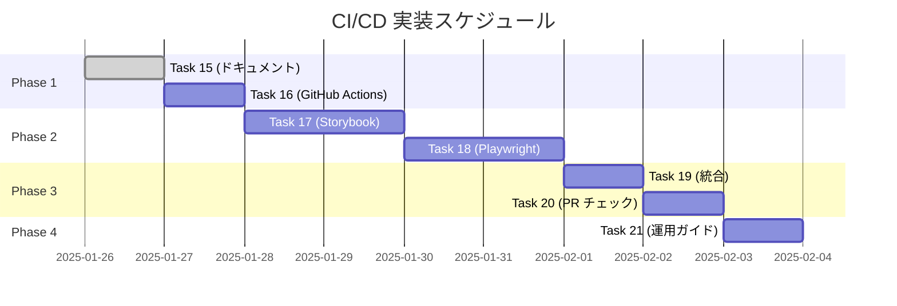

# CI/CD 実装タスクチケット

## 📋 タスク概要

全7タスクで本格的なCI/CD環境を構築します。各タスクは段階的に実装し、前のタスクが完了してから次に進みます。

---

## 🎫 Task #15: CI/CD基本概念と導入メリットの説明書作成
**優先度**: 🔴 High  
**ステータス**: ✅ 完了  
**推定時間**: 1時間  

### 📝 概要
CI/CD の基本概念、導入メリット、技術構成を初心者向けに解説したドキュメントを作成。

### ✅ 完了条件
- [x] CI/CD とは何かの説明
- [x] 導入メリットの具体例
- [x] 技術構成と設定項目の詳細解説
- [x] プルリクエスト戦略の説明

---

## 🎫 Task #16: GitHub Actions基本設定と環境変数設定手順書作成
**優先度**: 🔴 High  
**ステータス**: ⏳ 待機中  
**推定時間**: 2時間  

### 📝 概要
GitHub Actions の基本ワークフロー設定と Firebase 連携のための環境変数設定を実装。

### 🎯 実装内容
1. **基本CI ワークフロー作成**
   - TypeScript 型チェック
   - ESLint 実行
   - ビルド確認
   - 複数Node.js バージョンでのテスト

2. **Firebase デプロイ ワークフロー**
   - 本番環境自動デプロイ（main ブランチ）
   - プレビュー環境デプロイ（PR）

3. **GitHub Secrets 設定**
   - Firebase 設定値
   - サービスアカウントキー

### ✅ 完了条件
- [ ] `.github/workflows/ci.yml` 作成
- [ ] `.github/workflows/preview.yml` 作成
- [ ] `firebase.json` 設定
- [ ] GitHub Secrets 設定完了
- [ ] 1回の成功したCI実行確認

### 📋 手順書
1. Firebase プロジェクト作成
2. Firebase CLI でサービスアカウント生成
3. GitHub Secrets に全設定値を登録
4. ワークフローファイル作成
5. テストプッシュで動作確認

---

## 🎫 Task #17: Storybookセットアップとコンポーネントテスト環境構築
**優先度**: 🔴 High  
**ステータス**: ⏳ 待機中  
**推定時間**: 3時間  

### 📝 概要
Storybook を使用したコンポーネント単体テスト環境を構築し、CI/CD パイプラインに統合。

### 🎯 実装内容
1. **Storybook セットアップ**
   - React + TypeScript + Material-UI 対応
   - Tailwind CSS 連携
   - Firebase 認証モック

2. **コンポーネントストーリー作成**
   - LoginForm のストーリー
   - DataItemModal のストーリー
   - LoadingSpinner のストーリー
   - ErrorMessage のストーリー

3. **自動テスト設定**
   - Visual Regression Testing
   - Accessibility Testing
   - Interaction Testing

### ✅ 完了条件
- [ ] Storybook セットアップ完了
- [ ] 主要コンポーネント4つのストーリー作成
- [ ] CI での Storybook ビルド成功
- [ ] Visual Testing 実行確認
- [ ] Accessibility チェック実行確認

### 📋 設定ファイル
```bash
# 予定する設定ファイル
.storybook/
  ├── main.ts
  ├── preview.ts
  └── test-runner.ts
src/stories/
  ├── LoginForm.stories.tsx
  ├── DataItemModal.stories.tsx
  └── LoadingSpinner.stories.tsx
```

---

## 🎫 Task #18: Playwrightセットアップとエンドツーエンドテスト環境構築  
**優先度**: 🔴 High  
**ステータス**: ⏳ 待機中  
**推定時間**: 4時間  

### 📝 概要
Playwright を使用したE2Eテスト環境を構築し、主要なユーザーフローをテスト。

### 🎯 実装内容
1. **Playwright セットアップ**
   - Chrome, Firefox, Safari でのテスト
   - モバイルビューポートでのテスト
   - スクリーンショット比較テスト

2. **E2E テストシナリオ作成**
   - ユーザー登録フロー
   - ログイン/ログアウトフロー  
   - データ作成・編集・削除フロー
   - プロフィール更新フロー

3. **Firebase テストデータ管理**
   - テスト用データベース設定
   - テストユーザー自動作成
   - テスト後のデータクリーンアップ

### ✅ 完了条件
- [ ] Playwright セットアップ完了
- [ ] 4つの主要フローのテスト作成
- [ ] CI でのE2Eテスト実行成功
- [ ] 複数ブラウザでのテスト確認
- [ ] スクリーンショット比較テスト動作確認

### 📋 テストファイル構成
```bash
# 予定するテスト構成
tests/
  ├── auth/
  │   ├── login.spec.ts
  │   ├── register.spec.ts
  │   └── logout.spec.ts
  ├── data/
  │   ├── crud-operations.spec.ts
  │   └── real-time-sync.spec.ts
  └── profile/
      └── profile-update.spec.ts
```

---

## 🎫 Task #19: CI/CDパイプラインでのテスト統合とブランチ保護設定
**優先度**: 🟡 Medium  
**ステータス**: ⏳ 待機中  
**推定時間**: 2時間  

### 📝 概要
Storybook と Playwright を CI/CD パイプラインに統合し、ブランチ保護ルールを設定。

### 🎯 実装内容
1. **CI ワークフロー拡張**
   - Storybook テスト実行
   - Playwright E2E テスト実行
   - 並列実行による時間短縮
   - テスト結果レポート生成

2. **ブランチ保護ルール設定**
   - main ブランチ保護
   - 必須ステータスチェック設定
   - レビュー必須設定

3. **テスト結果通知**
   - GitHub Checks での結果表示
   - PR コメントでの詳細レポート

### ✅ 完了条件
- [ ] CI でのStorybook テスト実行成功
- [ ] CI でのPlaywright テスト実行成功
- [ ] ブランチ保護ルール設定完了
- [ ] テスト失敗時のマージブロック確認
- [ ] テスト成功時のマージ許可確認

---

## 🎫 Task #20: プルリクエスト自動チェック機能の実装
**優先度**: 🟡 Medium  
**ステータス**: ⏳ 待機中  
**推定時間**: 2時間  

### 📝 概要
プルリクエスト作成時の自動チェック機能と、品質ゲートの実装。

### 🎯 実装内容
1. **PR テンプレート作成**
   - チェックリスト付きテンプレート
   - 変更内容記述促進
   - テスト方法の記述必須

2. **自動品質チェック**
   - コードカバレッジ測定
   - 依存関係脆弱性スキャン
   - バンドルサイズチェック
   - パフォーマンス測定

3. **PR ラベル自動付与**
   - 変更ファイルに基づくラベル付与
   - テスト状況ラベル
   - レビュー状況ラベル

### ✅ 完了条件
- [ ] PR テンプレート作成
- [ ] コードカバレッジレポート生成
- [ ] 脆弱性スキャン実行
- [ ] バンドルサイズチェック実行
- [ ] 自動ラベル付与動作確認

### 📋 品質ゲート基準
| チェック項目 | 合格基準 | 失敗時動作 |
|-------------|----------|-----------|
| **テストカバレッジ** | 80%以上 | マージNG |
| **バンドルサイズ** | 増加10%以内 | 警告 |
| **脆弱性** | High以上なし | マージNG |
| **型チェック** | エラーなし | マージNG |

---

## 🎫 Task #21: CI/CD運用ガイドライン作成
**優先度**: 🟢 Low  
**ステータス**: ⏳ 待機中  
**推定時間**: 1時間  

### 📝 概要
チーム開発での CI/CD 運用方法とトラブルシューティングガイドを作成。

### 🎯 実装内容
1. **日常運用ガイド**
   - 開発者向けワークフロー
   - CI 失敗時の対処法
   - 緊急時のロールバック手順

2. **トラブルシューティング**
   - よくあるエラーと解決法
   - パフォーマンス改善Tips
   - セキュリティベストプラクティス

3. **運用メトリクス**
   - CI 実行時間監視
   - 成功率測定
   - デプロイ頻度追跡

### ✅ 完了条件
- [ ] 運用ガイドドキュメント作成
- [ ] トラブルシューティングガイド作成
- [ ] メトリクス監視設定
- [ ] チーム向け説明会資料作成

---

## 📊 全体スケジュール



**予想総作業時間**: 15時間（約2-3日）  
**完了予定**: 2025年1月末

---

## 🎯 成功の定義

### フェーズ1完了時
- ✅ 基本的なCI/CDパイプライン動作
- ✅ Firebase 自動デプロイ成功  

### フェーズ2完了時  
- ✅ Storybook コンポーネントテスト自動実行
- ✅ Playwright E2Eテスト自動実行

### フェーズ3完了時
- ✅ プルリクエストでのテスト失敗時マージブロック
- ✅ 品質ゲートによる自動品質管理

### 最終完了時
- ✅ 完全自動化されたCI/CDパイプライン
- ✅ チーム運用可能な品質管理体制
- ✅ 平均デプロイ時間3分以内達成

これらのタスクを順番に実装していくことで、プロダクションレベルのCI/CD環境が完成します！🚀